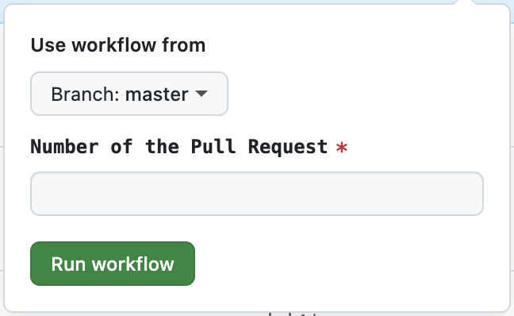

# Running commands

Command bot has been migrated, it is no longer a comment parser and now it is a GitHub action that works as a [`workflow_dispatch`](https://docs.github.com/en/actions/using-workflows/events-that-trigger-workflows#workflow_dispatch) event.

## How to run an action

To run an action, you need to go to the [_actions tab_](https://github.com/paritytech/polkadot-sdk/actions) and pick the one you desire to run.

The current available command actions are:

- [Command FMT](https://github.com/paritytech/polkadot-sdk/actions/workflows/command-fmt.yml)
- [Command Update UI](https://github.com/paritytech/polkadot-sdk/actions/workflows/command-update-ui.yml)
- [Command Prdoc](https://github.com/paritytech/polkadot-sdk/actions/workflows/command-prdoc.yml)
- [Command Sync](https://github.com/paritytech/polkadot-sdk/actions/workflows/command-sync.yml)
- [Command Bench](https://github.com/paritytech/polkadot-sdk/actions/workflows/command-bench.yml)
- [Command Bench All](https://github.com/paritytech/polkadot-sdk/actions/workflows/command-bench-all.yml)
- [Command Bench Overhead](https://github.com/paritytech/polkadot-sdk/actions/workflows/command-bench-overhead.yml)

You need to select the action, and click on the dropdown that says: `Run workflow`. It is located in the upper right.

If this dropdown is not visible, you may not have permission to run the action. Contact IT for help.



Each command will have the same two required values, but it could have more.

GitHub's official documentation: [Manually running a workflow](https://docs.github.com/en/actions/using-workflows/manually-running-a-workflow)

#### Running from CLI

You can use [`gh cli`](https://cli.github.com/) to run the commands too. Refers to the [`gh workflow run`](https://cli.github.com/manual/gh_workflow_run) section from the documentation for more information.

### Number of the Pull Request

The number of the pull request. Required so the action can fetch the correct branch and comment if it fails.

## Action configurations

### FMT

For FMT you only need the PR number.

You can use the following [`gh cli`](https://cli.github.com/) inside the repo:

```bash
gh workflow run command-fmt.yml -f pr=1000
```

### Update UI

For Update UI you only need the PR number.

You can use the following [`gh cli`](https://cli.github.com/) inside the repo:

```bash
gh workflow run command-update-ui.yml -f pr=1000
```

### Bench

Runs `benchmark pallet` or `benchmark overhead` against your PR and commits back updated weights.

Posible combinations based on the `benchmark` dropdown.

- `substrate-pallet`: Pallet Benchmark for Substrate for specific pallet
  - Requires `Subcommand` to be `pallet`
  - Requires `Runtime` to be `dev`
  - Requires field `Pallet` to have an input that applies to `^([a-z_]+)([:]{2}[a-z_]+)?$`
  - Requires `Target Directory` to be `substrate`
- `polkadot-pallet`: Pallet Benchmark for Polkadot for specific pallet
  - Requires `Subcommand` to be one of the following:
    - `pallet`
    - `xcm`
  - Requires `Runtime` to be one of the following:
    - `rococo`
    - `westend`
  - Requires field `Pallet` to have an input that applies to `^([a-z_]+)([:]{2}[a-z_]+)?$`
  - Requires `Target Directory` to be `polkadot`
- `cumulus-assets`: Pallet Benchmark for Cumulus assets
  - Requires `Subcommand` to be one of the following:
    - `pallet`
    - `xcm`
  - Requires `Runtime` to be one of the following:
    - `asset-hub-westend`
    - `asset-hub-rococo`
  - Requires field `Pallet` to have an input that applies to `^([a-z_]+)([:]{2}[a-z_]+)?$`
  - Requires `Runtime Dir` to be `assets`
  - Requires `Target Directory` to be `cumulus`
- `cumulus-collectives`: Pallet Benchmark for Cumulus collectives
  - Requires `Subcommand` to be one of the following:
    - `pallet`
    - `xcm`
  - Requires `Runtime` to be `collectives-westend`
  - Requires field `Pallet` to have an input that applies to `^([a-z_]+)([:]{2}[a-z_]+)?$`
  - Requires `Runtime Dir` to be `collectives`
  - Requires `Target Directory` to be `cumulus`
- `cumulus-coretime`: Pallet Benchmark for Cumulus coretime
  - Requires `Subcommand` to be one of the following:
    - `pallet`
    - `xcm`
  - Requires `Runtime` to be one of the following:
    - `coretime-rococo`
    - `coretime-westend`
  - Requires field `Pallet` to have an input that applies to `^([a-z_]+)([:]{2}[a-z_]+)?$`
  - Requires `Runtime Dir` to be `coretime`
  - Requires `Target Directory` to be `cumulus`
- `cumulus-bridge-hubs`: Pallet Benchmark for Cumulus bridge-hubs
  - Requires `Subcommand` to be one of the following:
    - `pallet`
    - `xcm`
  - Requires `Runtime` to be one of the following:
    - `bridge-hub-rococo`
    - `bridge-hub-westend`
  - Requires field `Pallet` to have an input that applies to `^([a-z_]+)([:]{2}[a-z_]+)?$`
  - Requires `Runtime Dir` to be `bridge-hub`
  - Requires `Target Directory` to be `cumulus`
- `cumulus-contracts`: Pallet Benchmark for Cumulus contracts
  - Requires `Subcommand` to be one of the following:
    - `pallet`
    - `xcm`
  - Requires `Runtime` to be one `contracts-rococo`
  - Requires field `Pallet` to have an input that applies to `^([a-z_]+)([:]{2}[a-z_]+)?$`
  - Requires `Runtime Dir` to be `contracts`
  - Requires `Target Directory` to be `cumulus`
- `cumulus-glutton`: Pallet Benchmark for Cumulus glutton
  - Requires `Subcommand` to be `pallet`
  - Requires `Runtime` to be one of the following:
    - `glutton-westend`
    - `glutton-westend-dev-1300`
  - Requires field `Pallet` to have an input that applies to `^([a-z_]+)([:]{2}[a-z_]+)?$`
  - Requires `Runtime Dir` to be `glutton`
  - Requires `Target Directory` to be `cumulus`
- `cumulus-starters`: Pallet Benchmark for Cumulus starters
  - Requires `Subcommand` to be one of the following:
    - `pallet`
    - `xcm`
  - Requires `Runtime` to be one of the following:
    - `seedling`
    - `shell`
  - Requires field `Pallet` to have an input that applies to `^([a-z_]+)([:]{2}[a-z_]+)?$`
  - Requires `Runtime Dir` to be `starters`
  - Requires `Target Directory` to be `cumulus`
- `cumulus-people`: Pallet Benchmark for Cumulus people
  - Requires `Subcommand` to be one of the following:
    - `pallet`
    - `xcm`
  - Requires `Runtime` to be one of the following:
    - `people-westend`
    - `people-rococo`
  - Requires field `Pallet` to have an input that applies to `^([a-z_]+)([:]{2}[a-z_]+)?$`
  - Requires `Runtime Dir` to be `people`
  - Requires `Target Directory` to be `cumulus`
- `cumulus-testing`: Pallet Benchmark for Cumulus testing
  - Requires `Subcommand` to be one of the following:
    - `pallet`
    - `xcm`
  - Requires `Runtime` to be one of the following:
    - `penpal`
    - `rococo-parachain`
  - Requires field `Pallet` to have an input that applies to `^([a-z_]+)([:]{2}[a-z_]+)?$`
  - Requires `Runtime Dir` to be `testing`
  - Requires `Target Directory` to be `cumulus`

You can use the following [`gh cli`](https://cli.github.com/) inside the repo:

```bash
gh workflow run command-bench.yml -f pr=1000 -f benchmark=polkadot-pallet -f subcommand=pallet -f runtime=rococo -f pallet=pallet_name -f target_dir=polkadot
```

### Bench-all

This is a wrapper to run `bench` for all pallets.

Posible combinations based on the `benchmark` dropdown.

- `pallet`: Benchmark for Substrate/Polkadot/Cumulus/Trappist for specific pallet
  - Requires field `Pallet` to have an input that applies to `^([a-z_]+)([:]{2}[a-z_]+)?$`
- `substrate`: Pallet + Overhead + Machine Benchmark for Substrate for all pallets
  - Requires `Target Directory` to be `substrate`
- `polkadot`: Pallet + Overhead Benchmark for Polkadot
  - Requires `Runtime` to be one of the following:
    - `rococo`
    - `westend`
  - Requires `Target Directory` to be `polkadot`
- `cumulus`: Pallet Benchmark for Cumulus
  - Requires `Runtime` to be one of the following:
    - `rococo`
    - `westend`
    - `asset-hub-kusama`
    - `asset-hub-polkadot`
    - `asset-hub-rococo`
    - `asset-hub-westend`
    - `bridge-hub-kusama`
    - `bridge-hub-polkadot`
    - `bridge-hub-rococo`
    - `bridge-hub-westend`
    - `collectives-polkadot`
    - `collectives-westend`
    - `coretime-rococo`
    - `coretime-westend`
    - `contracts-rococo`
    - `glutton-kusama`
    - `glutton-westend`
    - `people-rococo`
    - `people-westend`
  - Requires `Target Directory` to be `cumulus`

You can use the following [`gh cli`](https://cli.github.com/) inside the repo:

```bash
gh workflow run command-bench-all.yml -f pr=1000 -f benchmark=pallet -f pallet=pallet_name -f target_dir=polkadot -f runtime=rococo
```

### Bench-overhead

Run benchmarks overhead and commit back results to PR.

Posible combinations based on the `benchmark` dropdown.

- `default`: Runs `benchmark overhead` and commits back to PR the updated `extrinsic_weights.rs` files
  - Requires `Runtime` to be one of the following:
    - `rococo`
    - `westend`
  - Requires `Target directory` to be `polkadot`
- `substrate`: Runs `benchmark overhead` and commits back to PR the updated `extrinsic_weights.rs` files
  - Requires `Target directory` to be `substrate`
- `cumulus`: Runs `benchmark overhead` and commits back to PR the updated `extrinsic_weights.rs` files
  - Requires `Runtime` to be one of the following:
    - `asset-hub-rococo`
    - `asset-hub-westend`
  - Requires `Target directory` to be `cumulus`

You can use the following [`gh cli`](https://cli.github.com/) inside the repo:

```bash
gh workflow run command-bench-overheard.yml -f pr=1000 -f benchmark=substrate -f runtime=rococo -f target_dir=substrate
```

### PrDoc

Generate a PrDoc with the crates populated by all modified crates.

Options:
- `pr`: The PR number to generate the PrDoc for.
- `audience`: The audience of whom the changes may concern.
- `bump`: A default bump level for all crates. The PrDoc will likely need to be edited to reflect the actual changes after generation.
- `overwrite`: Whether to overwrite any existing PrDoc.

### Sync

Run sync and commit back results to PR.

Posible combinations based on the `benchmark` dropdown.

- `chain`
  - Requires one of the following:
    - `rococo`
    - `westend`
- `sync-type`
  - Requires one of the following:
    - `warp`
    - `full`
    - `fast`
    - `fast-unsafe`

You can use the following [`gh cli`](https://cli.github.com/) inside the repo:

```bash
gh workflow run command-sync.yml -f pr=1000 -f chain=rococo -f sync-type=full
```

## How to modify an action

If you want to modify an action and test it, you can do by simply pushing your changes and then selecting your branch in the `Use worflow from` option.

This will use a file from a specified branch.
