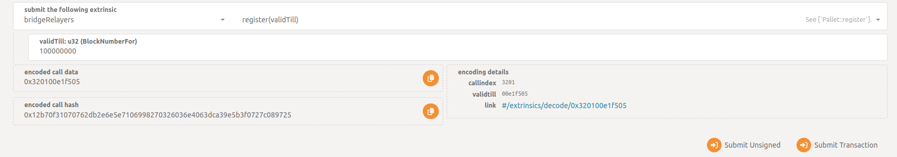
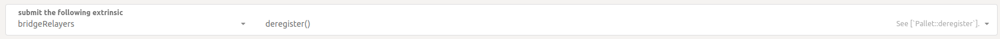
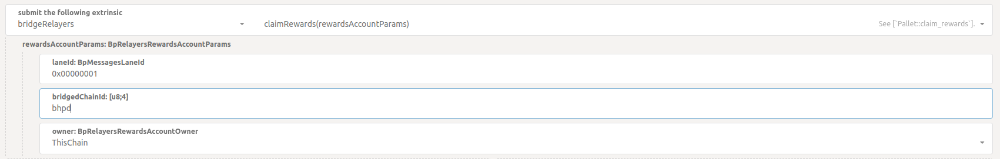

# Running your own bridge relayer

:warning: :construction: Please read the [Disclaimer](#disclaimer) section first :construction: :warning:

## Disclaimer

There are several things you should know before running your own relayer:

- initial bridge version (we call it bridges v1) supports any number of relayers, but **there's no guaranteed
compensation** for running a relayer and/or submitting valid bridge transactions. Most probably you'll end up
spending more funds than getting from rewards - please accept this fact;

- even if your relayer has managed to submit a valid bridge transaction that has been included into the bridge
hub block, there's no guarantee that you will be able to claim your compensation for that transaction. That's
because compensations are paid from the account, controlled by relay chain governance and it could have no funds
to compensate your useful actions. We'll be working on a proper process to resupply it on-time, but we can't
provide any guarantee until that process is well established.

## A Brief Introduction into Relayers and our Compensations Scheme

Omitting details, relayer is an offchain process that is connected to both bridged chains. It looks at the
outbound bridge messages queue and submits message delivery transactions to the target chain. There's a lot
of details behind that simple phrase - you could find more info in the
[High-Level Bridge Overview](./high-level-overview.md) document.

Reward that is paid to relayer has two parts. The first part static and is controlled by the governance.
It is rather small initially - e.g. you need to deliver `10_000` Kusama -> Polkadot messages to gain single
KSM token.

The other reward part is dynamic. So to deliver an XCM message from one BridgeHub to another, we'll need to
submit two transactions on different chains. Every transaction has its cost, which is:

- dynamic, because e.g. message size can change and/or fee factor of the target chain may change;

- quite large, because those transactions are quite heavy (mostly in terms of size, not weight).

We are compensating the cost of **valid**, **minimal** and **useful** bridge-related transactions to
relayer, that has submitted such transaction. Valid here means that the transaction doesn't fail. Minimal
means that all data within transaction call is actually required for the transaction to succeed. Useful
means that all supplied data in transaction is new and yet unknown to the target chain.

We have implemented a relayer that is able to craft such transactions. The rest of document contains a detailed
information on how to deploy this software on your own node.

## Relayers Concurrency

As it has been said above, we are not compensating cost of transactions that are not **useful**. For
example, if message `100` has already been delivered from Kusama Bridge Hub to Polkadot Bridge Hub, then another
transaction that delivers the same message `100` won't be **useful**. Hence, no compensation to relayer that
has submitted that second transaction.

But what if there are several relayers running? They are noticing the same queued message `100` and
simultaneously submit identical message delivery transactions. You may expect that there'll be one lucky
relayer, whose transaction would win the "race" and which will receive the compensation and reward. And
there'll be several other relayers, losing some funds on their unuseful transactions.

But actually, we have a solution that invalidates transactions of "unlucky" relayers before they are
included into the block. So at least you may be sure that you won't waste your funds on duplicate transactions.

<details>
<summary>Some details?</summary>

All **unuseful** transactions are rejected by our
[transaction extension](https://github.com/paritytech/polkadot-sdk/blob/master/bridges/bin/runtime-common/src/refund_relayer_extension.rs),
which also handles transaction fee compensations. You may find more info on unuseful (aka obsolete) transactions
by lurking in the code.

We also have the WiP prototype of relayers coordination protocol, where relayers will get some guarantee
that their transactions will be prioritized over other relayers transactions at their assigned slots.
That is planned for the future version of bridge and the progress is
[tracked here](https://github.com/paritytech/parity-bridges-common/issues/2486).

</details>

## Prerequisites

Let's focus on the bridge between Polkadot and Kusama Bridge Hubs. Let's also assume that we want to start
a relayer that "serves" an initial lane [`0x00000001`](https://github.com/polkadot-fellows/runtimes/blob/9ce1bbbbcd7843b3c76ba4d43c036bc311959e9f/system-parachains/bridge-hubs/bridge-hub-kusama/src/bridge_to_polkadot_config.rs#L54).

<details>
<summary>Lane?</summary>

Think of lane as a queue of messages that need to be delivered to the other/bridged chain. The lane is
bidirectional, meaning that there are four "endpoints". Two "outbound" endpoints (one at every chain), contain
messages that need to be delivered to the bridged chain. Two "inbound" are accepting messages from the bridged
chain and also remember the relayer, who has delivered message(s) to reward it later.

</details>

The same steps may be performed for other lanes and bridges as well - you'll just need to change several parameters.

So to start your relayer instance, you'll need to prepare:

- an address of ws/wss RPC endpoint of the Kusama relay chain;

- an address of ws/wss RPC endpoint of the Polkadot relay chain;

- an address of ws/wss RPC endpoint of the Kusama Bridge Hub chain;

- an address of ws/wss RPC endpoint of the Polkadot Bridge Hub chain;

- an account on Kusama Bridge Hub;

- an account on Polkadot Bridge Hub.

For RPC endpoints, you could start your own nodes, or use some public community nodes. Nodes are not meant to be
archive or provide access to insecure RPC calls.

To create an account on Bridge Hubs, you could use XCM teleport functionality. E.g. if you have an account on
the relay chain, you could use the `teleportAssets` call of `xcmPallet` and send asset
`V3 { id: Concrete(0, Here), Fungible: <your-amount> }` to beneficiary `V3(0, X1(AccountId32(<your-account>)))`
on destination `V3(0, X1(Parachain(1002)))`. To estimate amounts you need, please refer to the [Costs](#costs)
section of the document.

## Registering your Relayer Account (Optional, But Please Read)

Bridge transactions are quite heavy and expensive. We want to minimize block space that can be occupied by
invalid bridge transactions and prioritize valid transactions over invalid. That is achieved by **optional**
relayer registration. Transactions, signed by relayers with active registration, gain huge priority boost.
In exchange, such relayers may be slashed if they submit **invalid** or **non-minimal** transaction.

Transactions, signed by relayers **without** active registration, on the other hand, receive no priority
boost. It means that if there is active registered relayer, most likely all transactions from unregistered
will be counted as **unuseful**, not included into the block and unregistered relayer won't get any reward
for his operations.

Before registering, you should know several things about your funds:

- to register, you need to hold significant amount of funds on your relayer account. As of now, it is
  [100 KSM](https://github.com/polkadot-fellows/runtimes/blob/9ce1bbbbcd7843b3c76ba4d43c036bc311959e9f/system-parachains/bridge-hubs/bridge-hub-kusama/src/bridge_to_polkadot_config.rs#L71C14-L71C43)
  for registration on Kusama Bridge Hub and
  [500 DOT](https://github.com/polkadot-fellows/runtimes/blob/9ce1bbbbcd7843b3c76ba4d43c036bc311959e9f/system-parachains/bridge-hubs/bridge-hub-polkadot/src/bridge_to_kusama_config.rs#L71C14-L71C43)
  for registration on Polkadot Bridge Hub;

- when you are registered, those funds are reserved on relayer account and you can't transfer them.

The registration itself, has three states: active, inactive or expired. Initially, it is active, meaning that all
your transactions that are **validated** on top of block, where it is active get priority boost. Registration
becomes expired when the block with the number you have specified during registration is "mined". It is the
`validTill` parameter of the `register` call (see below). After that `validTill` block, you may unregister and get
your reserved funds back. There's also an intermediate point between those blocks - it is the `validTill - LEASE`,
where `LEASE` is the the chain constant, controlled by the governance. Initially it is set to `300` blocks.
All your transactions, **validated** between the `validTill - LEASE` and `validTill` blocks do not get the
priority boost. Also, it is forbidden to specify `validTill` such that the `validTill - currentBlock` is less
than the `LEASE`.

<details>
<summary>Example?</summary>

| Bridge Hub Block  | Registration State | Comment                                                |
| ----------------- | ------------------ | ------------------------------------------------------ |
| 100               | Active             | You have submitted a tx with the `register(1000)` call |
| 101               | Active             | Your message delivery transactions are boosted         |
| 102               | Active             | Your message delivery transactions are boosted         |
| ...               | Active             | Your message delivery transactions are boosted         |
| 700               | Inactive           | Your message delivery transactions are not boosted     |
| 701               | Inactive           | Your message delivery transactions are not boosted     |
| ...               | Inactive           | Your message delivery transactions are not boosted     |
| 1000              | Expired            | Your may submit a tx with the `deregister` call        |

</details>

So once you have enough funds on your account and have selected the `validTill` parameter value, you
could use the Polkadot JS apps to submit an extrinsic. If you want priority boost for your transactions
on the Kusama Bridge Hub, open the
[Polkadot JS Apps](https://polkadot.js.org/apps/?rpc=wss%3A%2F%2Fkusama-bridge-hub-rpc.polkadot.io#/extrinsics)
and submit the `register` extrinsic from the `bridgeRelayers` pallet:



To deregister, submit the simple `deregister` extrinsic when registration is expired:



At any time, you can prolong your registration by calling the `register` with the larger `validTill`.

## Costs

Your relayer account (on both Bridge Hubs) must hold enough funds to be able to pay costs of bridge
transactions. If your relayer behaves correctly, those costs will be compensated and you will be
able to claim it later.

**IMPORTANT**: you may add tip to your bridge transactions to boost their priority. But our
compensation mechanism never refunds transaction tip, so all tip tokens will be lost.

<details>
<summary>Types of bridge transactions</summary>

There are two types of bridge transactions:

- message delivery transaction brings queued message(s) from one Bridge Hub to another. We record
  the fact that this specific (your) relayer has delivered those messages;

- message confirmation transaction confirms that some message have been delivered and also brings
  back information on how many messages (your) relayer has delivered. We use this information later
  to register delivery rewards on the source chain.

Several messages/confirmations may be included in a single bridge transaction. Apart from this
data, bridge transaction may include finality and storage proofs, required to prove authenticity of
this data.

</details>

To deliver and get reward for a single message, the relayer needs to submit two transactions. One
at the source Bridge Hub and one at the target Bridge Hub. Below are costs for Polkadot <> Kusama
messages (as of today):

- to deliver a single Polkadot -> Kusama message, you would need to pay around `0.06 KSM` at Kusama
  Bridge Hub and around `1.62 DOT` at Polkadot Bridge Hub;

- to deliver a single Kusama -> Polkadot message, you would need to pay around `1.70 DOT` at Polkadot
  Bridge Hub and around `0.05 KSM` at Kusama Bridge Hub.

Those values are not constants - they depend on call weights (that may change from release to release),
on transaction sizes (that depends on message size and chain state) and congestion factor. In any
case - it is your duty to make sure that the relayer has enough funds to pay transaction fees.

## Claiming your Compensations and Rewards

Hopefully you have successfully delivered some messages and now can claim your compensation and reward.
This requires submitting several transactions. But first, let's check that you actually have something to
claim. For that, let's check the state of the pallet that tracks all rewards.

To check your rewards at the Kusama Bridge Hub, go to the
[Polkadot JS Apps](https://polkadot.js.org/apps/?rpc=wss%3A%2F%2Fkusama-bridge-hub-rpc.polkadot.io#/chainstate)
targeting Kusama Bridge Hub, select the `bridgeRelayers` pallet, choose `relayerRewards` map and
your relayer account. Then:

- set the `laneId` to `0x00000001`

- set the `bridgedChainId` to `bhpd`;

- check the both variants of the `owner` field: `ThisChain` is used to pay for message delivery transactions
  and `BridgedChain` is used to pay for message confirmation transactions.

If check shows that you have some rewards, you can craft the claim transaction, with similar parameters.
For that, go to `Extrinsics` tab of the
[Polkadot JS Apps](https://polkadot.js.org/apps/?rpc=wss%3A%2F%2Fkusama-bridge-hub-rpc.polkadot.io#/extrinsics)
and submit the following transaction (make sure to change `owner` before):



To claim rewards on Polkadot Bridge Hub you can follow the same process. The only difference is that you
need to set value of the `bridgedChainId` to `bhks`.

## Starting your Relayer

### Starting your Rococo <> Westend Relayer

You may find the relayer image reference in the
[Releases](https://github.com/paritytech/parity-bridges-common/releases)
of this repository. Make sure to check supported (bundled) versions
of release there. For Rococo <> Westend bridge, normally you may use the
latest published release. The release notes always contain the docker
image reference and source files, required to build relayer manually.

Once you have the docker image, update variables and run the following script:
```sh
export DOCKER_IMAGE=<image-of-substrate-relay>

export ROCOCO_HOST=<rococo-ws-rpc-host-here>
export ROCOCO_PORT=<rococo-ws-rpc-port-here>
# or set it to '--rococo-secure' if wss is used above
export ROCOCO_IS_SECURE=
export BRIDGE_HUB_ROCOCO_HOST=<bridge-hub-rococo-ws-rpc-host-here>
export BRIDGE_HUB_ROCOCO_PORT=<bridge-hub-rococo-ws-rpc-port-here>
# or set it to '--bridge-hub-rococo-secure' if wss is used above
export BRIDGE_HUB_ROCOCO_IS_SECURE=
export BRIDGE_HUB_ROCOCO_KEY_FILE=<absolute-path-to-file-with-account-key-at-bridge-hub-rococo>

export WESTEND_HOST=<westend-wss-rpc-host-here>
export WESTEND_PORT=<westend-wss-rpc-port-here>
# or set it to '--westend-secure' if wss is used above
export WESTEND_IS_SECURE=
export BRIDGE_HUB_WESTEND_HOST=<bridge-hub-westend-ws-rpc-host-here>
export BRIDGE_HUB_WESTEND_PORT=<bridge-hub-westend-ws-rpc-port-here>
# or set it to '--bridge-hub-westend-secure ' if wss is used above
export BRIDGE_HUB_WESTEND_IS_SECURE=
export BRIDGE_HUB_WESTEND_KEY_FILE=<absolute-path-to-file-with-account-key-at-bridge-hub-westend>

# you can get extended relay logs (e.g. for debugging issues) by passing `-e RUST_LOG=bridge=trace`
# argument to the `docker` binary
docker run \
    -v $BRIDGE_HUB_ROCOCO_KEY_FILE:/bhr.key \
    -v $BRIDGE_HUB_WESTEND_KEY_FILE:/bhw.key \
    $DOCKER_IMAGE \
    relay-headers-and-messages bridge-hub-rococo-bridge-hub-westend \
    --rococo-host $ROCOCO_HOST \
    --rococo-port $ROCOCO_PORT \
    $ROCOCO_IS_SECURE \
    --rococo-version-mode Auto \
    --bridge-hub-rococo-host $BRIDGE_HUB_ROCOCO_HOST \
    --bridge-hub-rococo-port $BRIDGE_HUB_ROCOCO_PORT \
    $BRIDGE_HUB_ROCOCO_IS_SECURE \
    --bridge-hub-rococo-version-mode Auto \
    --bridge-hub-rococo-signer-file /bhr.key \
    --bridge-hub-rococo-transactions-mortality 16 \
    --westend-host $WESTEND_HOST \
    --westend-port $WESTEND_PORT \
    $WESTEND_IS_SECURE \
    --westend-version-mode Auto \
    --bridge-hub-westend-host $BRIDGE_HUB_WESTEND_HOST \
    --bridge-hub-westend-port $BRIDGE_HUB_WESTEND_PORT \
    $BRIDGE_HUB_WESTEND_IS_SECURE \
    --bridge-hub-westend-version-mode Auto \
    --bridge-hub-westend-signer-file /bhw.key \
    --bridge-hub-westend-transactions-mortality 16 \
    --lane 00000002
```

### Starting your Polkadot <> Kusama Relayer

*Work in progress, coming soon*

### Watching your relayer state

Our relayer provides some Prometheus metrics that you may convert into some fancy Grafana dashboards
and alerts. By default, metrics are exposed at port `9616`. To expose endpoint to the localhost, change
the docker command by adding following two lines:

```sh
docker run \
    ..
    -p 127.0.0.1:9616:9616 \ # tell Docker to bind container port 9616 to host port 9616
                             # and listen for connections on the host' localhost interface
    ..
    $DOCKER_IMAGE \
    relay-headers-and-messages bridge-hub-rococo-bridge-hub-westend \
    --prometheus-host 0.0.0.0 \ # tell `substrate-relay` binary to accept Prometheus endpoint
                                # connections from everywhere
    ..
```

You can find more info on configuring Prometheus and Grafana in the
[Monitor your node](https://wiki.polkadot.network/docs/maintain-guides-how-to-monitor-your-node)
guide from Polkadot wiki.

We have our own set of Grafana dashboards and alerts. You may use them for inspiration.
Please find them in this folder:

- for Rococo <> Westend bridge: [rococo-westend](https://github.com/paritytech/parity-bridges-common/tree/master/deployments/bridges/rococo-westend).

- for Polkadot <> Kusama bridge: *work in progress, coming soon*
