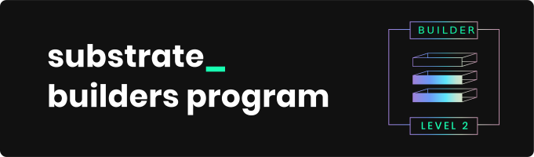

# Introduction

Snowbridge is a general purpose, trustless and decentralized bridge between Polkadot and Ethereum.

Our goal is to launch as common-good bridge on the proposed BridgeHub parachain.

<figure><figcaption></figcaption></figure>

<figure><figcaption></figcaption></figure>

## Contact us 

To get in contact, please create a discussion thread [here](https://github.com/Snowfork/snowbridge/discussions).

## Disclaimer 

There is no guarantee of functionality or safety. You use Snowbridge entirely at your own risk.
