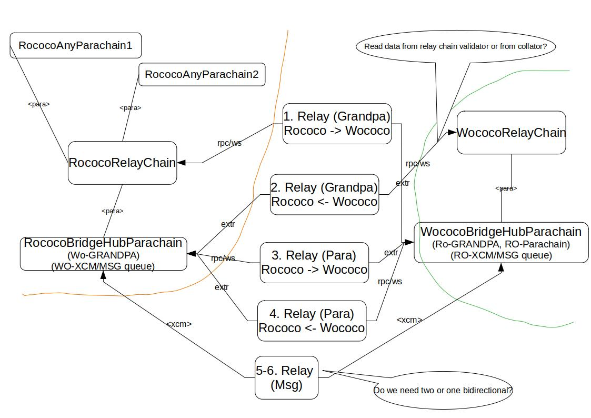

# Bridge-hubs Parachain

Implementation of _BridgeHub_, a blockchain to support message passing between Substrate based chains like Polkadot and Kusama networks.

_BridgeHub_ allows users to:

- Passing arbitrary messages between different Substrate chains (Polkadot <-> Kusama).
  -- Message passing is

_BridgeHub_ is meant to be **_system parachain_** with main responsibilities:
- sync finality proofs between relay chains
- sync finality proofs between BridgeHub parachains
- pass (XCM) messages between different BridgeHub parachains



## How to try locally
```
cd <base-cumulus-repo-directory>
cargo build --release -p polkadot-parachain@0.9.320

# script expect to have pre-built polkadot binary on the path: ../polkadot/target/release/polkadot
# if using kusama-local, build polkadot with `--features fast-runtime`

# BridgeHubRococo
zombienet-linux --provider native spawn ./zombienet/examples/bridge_hub_rococo_local_network.toml

# or

# BridgeHubKusama
zombienet-linux --provider native spawn ./zombienet/examples/bridge_hub_kusama_local_network.toml
```
