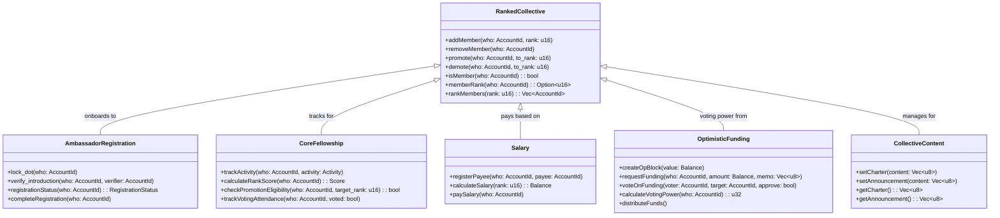

# Polkadot Ambassador Fellowship UML Diagrams

## System Architecture Diagram

## Rank System Class Diagram

## Onboarding Sequence Diagram

## Promotion Flow Diagram

## Voting Weight System

## Optimistic Funding Sequence Diagram

## Fellowship Vertical Structure

## Decision Making System

