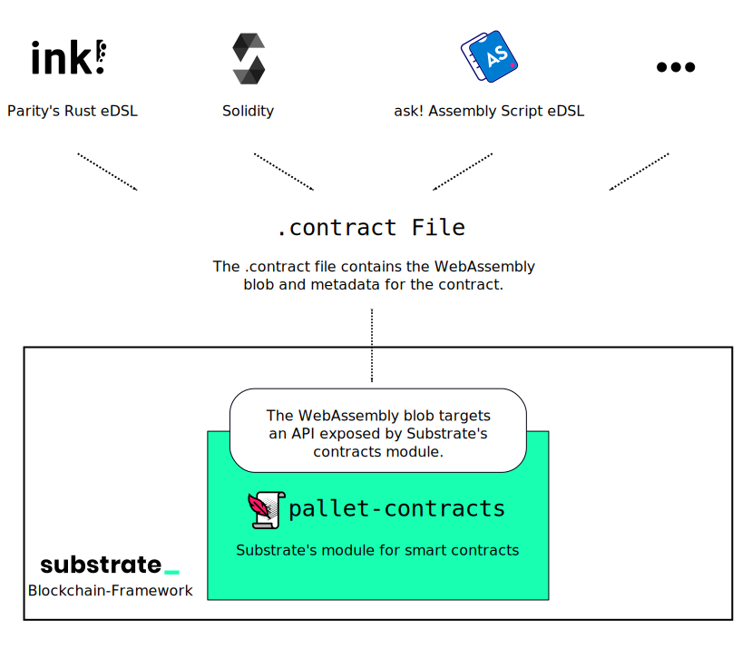

# Contracts 📝

This is a parachain node for smart contracts; it contains a default configuration of
Substrate's module for smart contracts ‒ the [`pallet-contracts`](https://github.com/paritytech/polkadot-sdk/tree/master/substrate/frame/contracts).

The node is only available on Rococo, a testnet for Polkadot and Kusama parachains.
It has been configured as a common good parachain, as such it uses the Rococo relay
chain's native token `ROC` instead of defining a token of its own.
See the section [Rococo Deployment](#rococo-deployment) below for more details.

If you have any questions, it's best to ask in the
[Substrate StackExchange](https://substrate.stackexchange.com/).

## Smart Contracts Development



This node contains Substrate's smart contracts module ‒ the
[`pallet-contracts`](https://github.com/paritytech/polkadot-sdk/tree/master/substrate/frame/contracts).
This pallet takes smart contracts as WebAssembly blobs and defines an API
for everything a smart contract needs (storage access, …).
As long as a programming language compiles to WebAssembly and there exists an implementation
of this API in it, you can write a smart contract for this pallet (and thus for this parachain)
in that language.

This is a list of languages you can currently choose from:

* [Parity's ink!](https://github.com/paritytech/ink) for Rust.
* [ask!](https://github.com/patractlabs/ask) for Assembly Script.
* The [Solang](https://github.com/hyperledger-labs/solang) compiler for Solidity.

There are also different user interfaces and command-line tools you can use to deploy
or interact with contracts:

* [Contracts UI](https://paritytech.github.io/contracts-ui/) ‒ a beginner-friendly UI for smart contract developers.
* [`polkadot-js`](https://polkadot.js.org/apps/) ‒ the go-to expert UI for smart contract developers.
* [`cargo-contract`](https://github.com/paritytech/cargo-contract) ‒ a CLI tool, ideal for scripting or your terminal workflow.

If you are looking for a quickstart, we can recommend
[ink!'s Guided Tutorial for Beginners](https://docs.substrate.io/tutorials/v3/ink-workshop/pt1/).

### Build & Launch a Node

To run a Contracts node that connects to Rococo
you will need to compile the `polkadot-parachain` binary:

```bash
cargo build --release --locked --bin polkadot-parachain
```

Once the executable is built, launch the parachain node via:

```bash
./target/release/polkadot-parachain --chain contracts-rococo
```

Refer to the [setup instructions](https://github.com/paritytech/polkadot-sdk/tree/master/cumulus#manual-setup) to run a
local network for development.

### Rococo Deployment

We have a live deployment on [Rococo](https://wiki.polkadot.network/docs/build-pdk#rococo-testnet) ‒
a testnet for Polkadot and Kusama parachains.

You can interact with the network through Polkadot JS Apps,
[click here for a direct link to the parachain](https://polkadot.js.org/apps/?rpc=wss%3A%2F%2Frococo-contracts-rpc.polkadot.io#/explorer).

This parachain uses the Rococo relay chain's native token `ROC` instead of defining a token of its own.
Due to this you'll need `ROC` in order to deploy contracts on this parachain.

As a first step, you should create an account. See [here](https://wiki.polkadot.network/docs/learn-account-generation)
for a detailed guide.

As a second step, you have to get `ROC` testnet tokens through the [Rococo Faucet](https://wiki.polkadot.network/docs/learn-DOT#obtaining-testnet-tokens).
This is a chat room in which you'd need to post the following message:

```bash
!drip YOUR_SS_58_ADDRESS:1002
```

The number `1002` is the id of this parachain on Rococo, by supplying it the faucet will teleport `ROC`
tokens directly to your account on the parachain.

If everything worked out, the teleported `ROC` tokens will show up under
[the "Accounts" tab](https://polkadot.js.org/apps/?rpc=wss%3A%2F%2Frococo-contracts-rpc.polkadot.io#/accounts).

Once you have `ROC` you can deploy a contract as you would normally.
If you're unsure about this, our [guided tutorial](https://use.ink/getting-started/deploy-your-contract)
will clarify that for you in no time.
