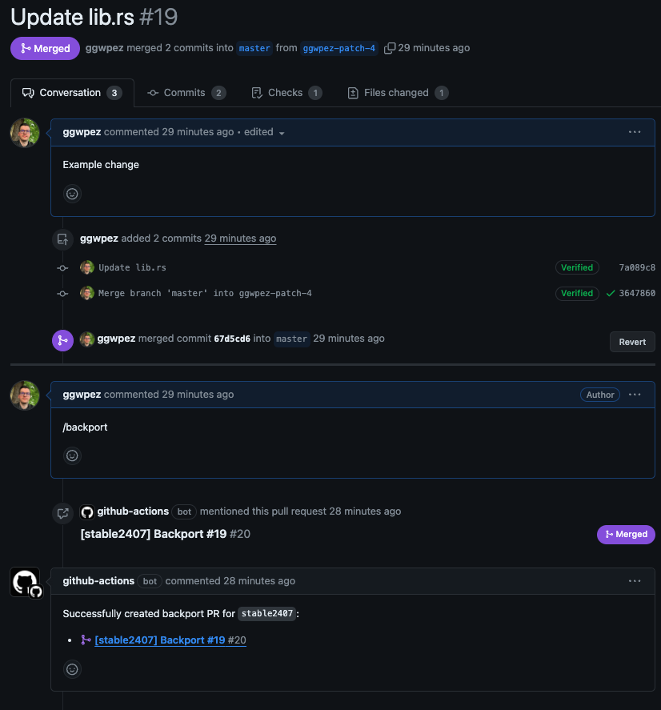
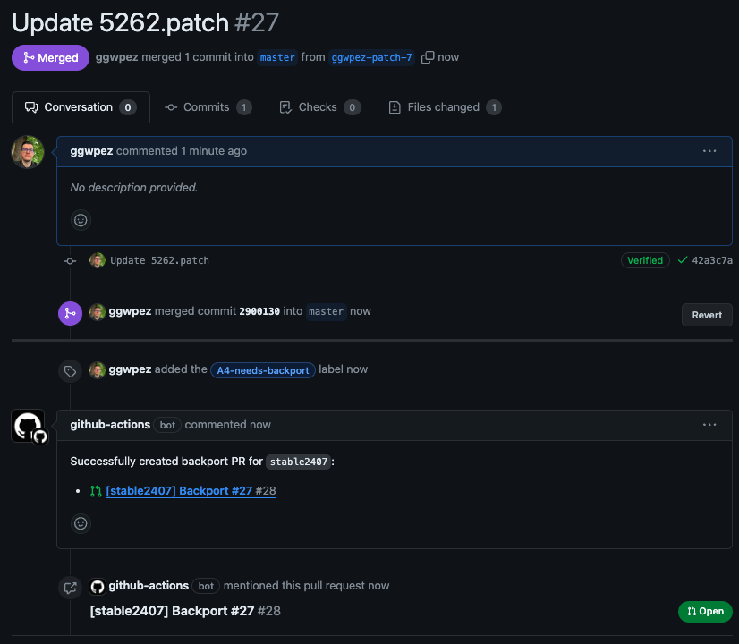
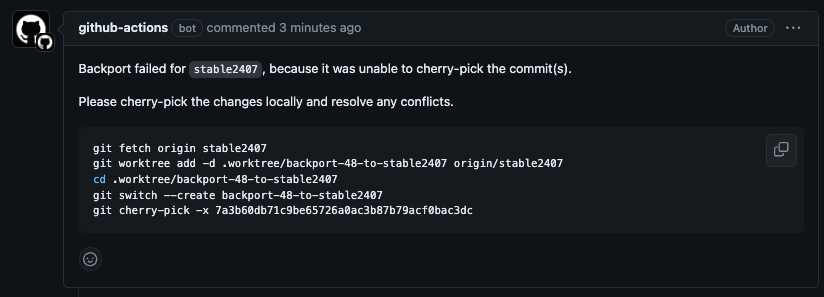

# Backporting

This document explains how to backport a merged PR from `master` to `stable`. Backports should only be used to fix bugs or security issues - never to introduce new features.

## Steps

1. Fix a bug through a PR that targets `master`.
2. Add label `A4-needs-backport` to the PR.
4. Merge the PR into `master`.
5. Wait for the bot to open the backport PR.
6. Ensure the change is audited or does not need audit.
7. Merge the backport PR. 

Alternatively to adding the label, you can also comment `/backport`. It should not be needed though, since the label can also be added after the PR is merged.

## Example

For example here where the dev triggered the process manually with a comment after the PR is merged:

Or triggering the process with a label after merging:

## Known Issue

The bot has a bug and will always try to also backport the backport. It will make a comment in the backport that you can ignore.

