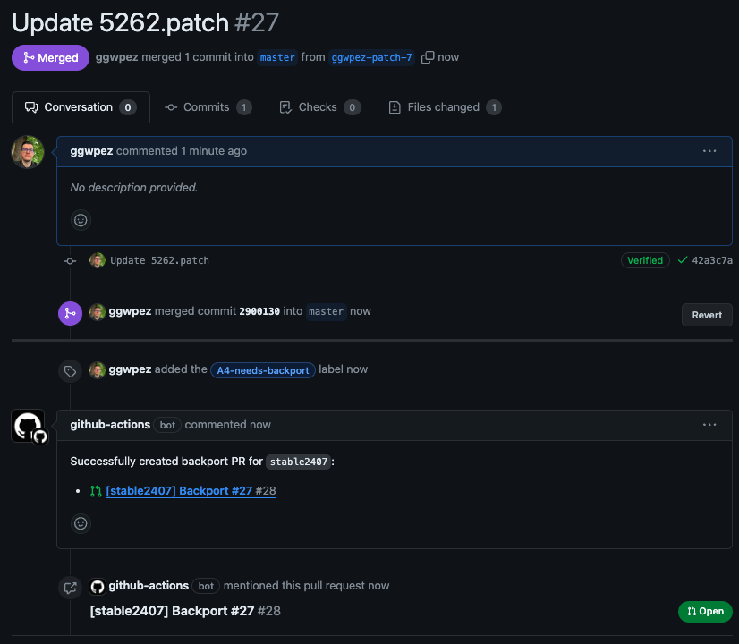

# Backporting

This document explains how to backport a merged PR from `master` to one of the `stable*` branches.
Backports should only be used to fix bugs or security issues - never to introduce new features.

## Steps

1. Fix a bug through a PR that targets `master`.
2. Add label `A4-needs-backport` to the PR.
3. Merge the PR into `master`.
4. Wait for the bot to open the backport PR.
5. Ensure the change is audited or does not need audit.
6. Merge the backport PR.

The label can also be added after the PR is merged.

## Example

For example here where the dev triggered the process by adding the label after merging:

