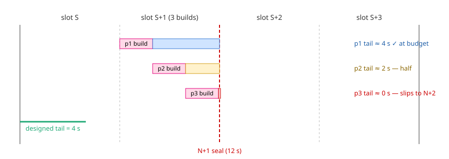
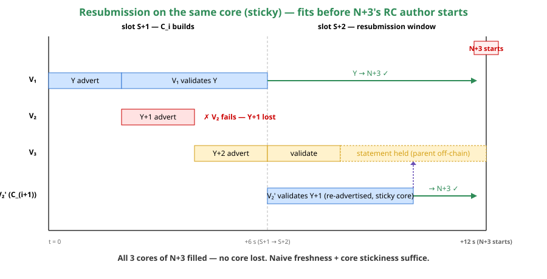
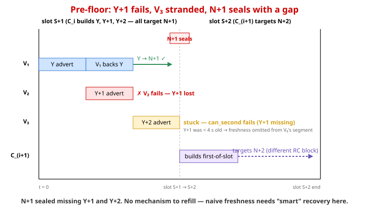
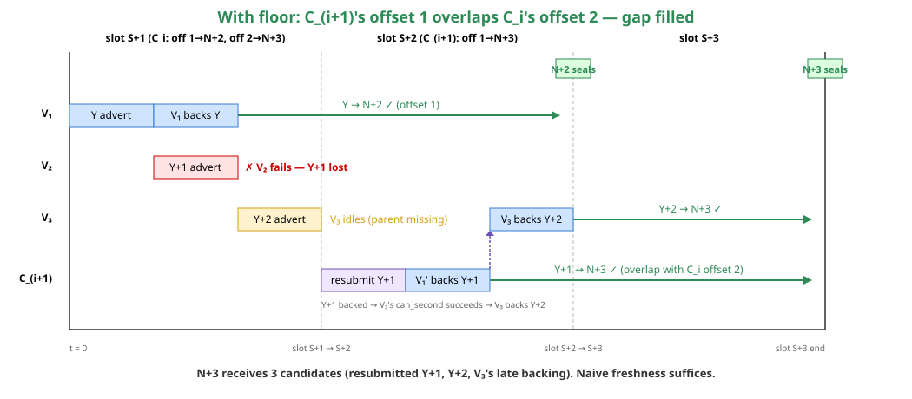
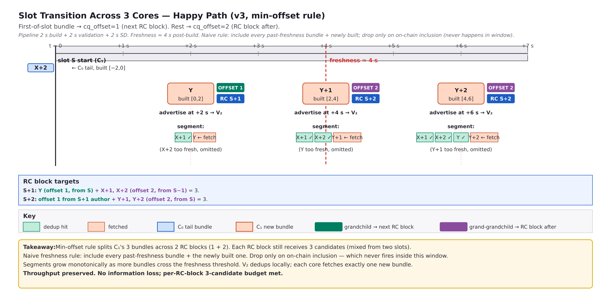
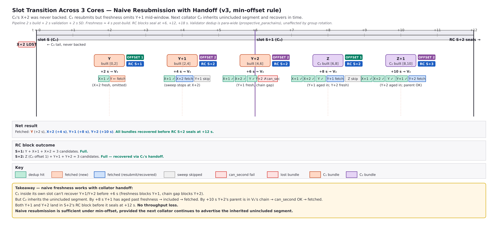

<!-- _class: lead -->
# Polkadot and Time

## Why slots are the unit, not an afterthought

eskimor

---

## A protocol problem disguised as a rewards problem

- We have a real problem in production: non-EU validators see **14× the missed-vote ratio** of EU validators on identical hardware (#10921).
- The proposed fix (#12063) keeps surfacing the question: *"is this really a protocol problem, or just incentives?"*
- I want to argue: **it is a protocol problem**, and we have been getting time wrong since async backing was designed.
- v3 is the first chance to fix it properly. Async backing tolerated this. Elastic scaling does not.

---

## Part 1 — Why blockchains have slots at all

---

## Slots are the decentralization knob

Every blockchain picks a slot duration. It is not arbitrary.

| Chain    | Slot   | What the duration says                                          |
|----------|--------|-----------------------------------------------------------------|
| Bitcoin  | 10 min | every full node on Earth should hear about a block within 10 min |
| Ethereum | 12 s   | every validator should hear about a slot leader within 12 s     |
| Polkadot | 6 s    | every validator should hear about a block within 6 s            |

The slot is the **global propagation budget**.

If you build a system where the fastest cluster wins inside the slot, the budget is no longer 6s — it is "however fast the EU cluster is".

---

## What the 6s of Polkadot actually mean

The design budget per slot:

| Phase                | Time |
|----------------------|------|
| block production     | 2 s  |
| block import (validation) | 2 s |
| network propagation  | 2 s  |
| **total**            | **6 s** |

Each phase is sized for the global validator set. The 2 s of propagation specifically is the budget for one block to reach every validator on Earth — that's the figure the slot length protects.

A node in São Paulo and a node in Frankfurt should be peers of the network, not first-class and second-class members. Slot duration ≥ network diameter is what makes that true.

---

## "But faster is better!"

Block production by itself takes ~2 s. Validation ~2 s. So if a node only had to talk to its immediate neighbours, blocks could chain together every few seconds.

A 6 s slot exists because the *network* — every validator on Earth — must catch up. Reducing the slot toward "as fast as the build is" structurally favours nodes that are closest to the producer.

> The slot is not a performance tax. It is the mechanism that lets validators across continents participate as peers.

---

## Part 2 — The same principle, applied to parachain consensus

---

## The backing pipeline is a propagation problem

| Block propagation (relay chain) | Backing pipeline (parachain) |
|---------------------------------|------------------------------|
| Author builds a block           | Collator builds a collation  |
| Sends to peers                  | Sends to backers (direct)    |
| Peers import (verify state)     | Backers validate the PoV     |
| Gossip / propagation across all | Statement-distribution across all validators |

Same budget shape: an artifact has to reach the entire validator set, and that takes slot-duration time. Faster than that means the rest of the world hasn't caught up.

The protocol gives the first pipeline a full slot. The second one deserves the same.

---

## Async backing got this *partly* right

Async backing's property: a parachain block no longer has to land in the *child* of its scheduling parent. It can land later — grandchild, great-grandchild — within the unincluded segment.

What it did not address: **there is still no minimum on how early a candidate can be backed.** Pre-ES this didn't bite — only one candidate per scheduling parent ever existed, so its tail had the slot to itself.

Elastic scaling produces N candidates per scheduling parent. Their tails now share the slot's propagation window, and the absence of a floor lets all N race the same RC block with compressed budgets.

---

## Elastic scaling = N propagation problems per slot

- **Scheduling parent** = RC block of the last finished slot = N. The collator builds during slot S+1.
- First reachable RC block = **N+2** (grandchild of N), built in slot S+2. N+1 is built at the same time as our parachain blocks — can't land there at all.
- Today there is **no floor** on `cq_offset`. Default `0` → target N+1. If the tail fits in the current slot, candidates land in N+1.
- With 3 cores, tails compress across the 3 builds — only the first has the designed budget.

---

## Tail compression with no floor (3 cores) — this is today

**This is the state right now on mainnet.** Per-candidate budget: `2 s build + 4 s tail = 6 s`. Today p1 is at budget, p2 half, p3 zero. The v3 fix (see slide 21) aligns the contract with the worst case — all 3 candidates target an RC block one slot further out, so every candidate gets a full tail with margin to spare.

---

## Part 3 — What that actually does to the network

---

## The data: 14× MVR penalty for non-EU

Multi-region 7-day data, 12 validators, identical hardware (#10921):

| Region | Validators | 7d mean MVR |
|--------|-----------|-------------|
| EU     | 2         | **0.10 %**  |
| APAC   | 5         | 1.38 %      |
| LATAM  | 5         | 1.30 %      |

- Max EU sample (0.31 %) is **below the minimum non-EU sample** (0.33 %).
- Effect is consistent across **every day** of the window.
- This is not jitter. It is structural geographic pressure.

---

## What does the EU validator see vs the LATAM validator?

`polkadot_parachain_provisioner_backable_vs_in_block_bucket`:

| Region | `le ≤ 0`     | `0 < le ≤ 5` |
|--------|--------------|--------------|
| EU     | **52.4 %**   | 45.7 %       |
| APAC   | 10.4 %       | 84.3 %       |
| LATAM  | 8.9 %        | 85.5 %       |

EU validators have all the backable candidates the author sees, **5× more often** than non-EU.

Non-EU validators are systematically a step behind — not because their nodes are slow, but because the backing window is too short to reach them.

---

## And remember: this is happening with **empty blocks**

This is the easy case.

Empty PoVs. Small ecosystem. Cluster-friendly validator distribution. And we are already breaking the budget.

The moment blocks fill, PoV validation takes its full 2s, or the parachain count grows — the situation only gets worse and crucially - behavior is load dependent/unstable.

**The system is failing the workload it was sized for.**

---

## Part 4 — How we got here: a history of fuzzy time

---

## v1 / v2: parachain slots designed outside protocol parameters

Polkadot's protocol parameter: 6 s slot. That's the time the protocol assumes is enough for an RC block to be available globally.

What v1 / v2 built for parachains:

- Build on the RC block of *the current* slot.
- That block isn't there yet at slot start (it is being built at the same time).
- Hack: offset the parachain slot by 1 s so the RC block can arrive.
- Hack on hack: collator waits even longer if the RC block is late (PR #11621, PR #11453).

The parachain layer implicitly assumed **1 s** of RC block availability is enough — not the protocol's 6 s slot. It redefined the slot downward.

Indirect consequence: when an RC block actually takes longer than 1 s to arrive, the parachain's own build / validate / propagate window shrinks accordingly.

---

## Part 5 — The v3 fix

---

## v3 in three layers

Each layer makes parachain timing more well-defined.

1. **Build on the relay chain block of the last *finished* slot.**
   No more racing the current-slot RC block. Honor the protocol budget for RC block propagation.
2. **Validators enforce this.** Parachain slots become well-defined; the #11621 / #11453 bug class is structurally impossible.
3. **(#12063) Enforce the minimum claim-queue offset on the relay chain.** A candidate's declared `cq_offset` is a *floor*. Backing can happen *at or after*, never *before*. The floor is enabling infrastructure: it lets the collator-side rule (next slide) deliver predictable timing and a clean recovery channel.

Layers (1) and (2) are already in v3. (3) is the proposal.

---

## The collator-side rule

| Case | `cq_offset` | Targets |
|------|-------------|---------|
| Normal submission (ES) | **2** | great-grandchild of scheduling parent |
| Resubmission (first core of next slot only) | **1** | same RC block as previous slot's offset 2 |
| Non-ES chains | 1 | grandchild |

**Why always offset 2 for ES:** aligns the protocol-minimum timing contract with the *worst-case last core*. Every candidate gets a full slot-sized propagation budget by construction — no compression.

**Why offset 1 only for resubmission:** valid only after a new scheduling parent has arrived, i.e. once the next slot has started. In practice = the *first core of the next collator's slot*. This is the recovery channel — same target RC block as the previous slot's offset-2 candidates, one slot earlier, so it lands before the target seals.

Cost: +1 slot inclusion latency for the first-of-slot ES block (the rest were already at offset 2). Non-ES chains can stay at offset 1.

---

## The wall-clock budget under always-offset-2

All 3 cores' candidates target N+3. Cores 1/2/3 finish with 6/4/2 s slack before N+3's RC author starts. Resubmission earliest re-advert at t=8 (Y+1 was advertised at t=4; freshness threshold 4 s) → 4 s tail → lands at t=12 exactly. **Zero slack, but it fits.**

---

## The relay-chain runtime change is small

The runtime check is small:

- `parse_ump_signals` / `check_core_index` in
  `polkadot/primitives/src/v9/mod.rs:2879–2973` already reads the
  candidate's declared `cq_offset` and verifies a core exists at
  that offset.
- Adding: *also* reject if the candidate is being backed at a
  position **earlier** than its declared offset.

Provisioner gets one filter; collator picks the offset per-core
instead of one-per-slot. That's it.

**This is not the dynamic-claim-queue-offset refactor (#9428).**

---

## Part 6 — Answering the objections

---

## "It is just a rewards issue. Fix incentives."

(Alin)

The rewards angle is real, but it's a downstream symptom. The mechanism upstream is *structural exclusion*: non-EU validators produce valid statements that never make it into the inherent, because the backing window closes before their statements arrive. They aren't "paid less for slow work" — their work is correct, just discarded.

Fixing rewards alone:
- doesn't restore the **prediction model** that #11903, speculative XCM, and agile coretime all build on. Without it, predictions become load dependent and unreliable.
- doesn't remove the centralizing pressure (rational operators still move to EU to avoid being structurally cut off).

The time model has to be right *before* the rewards layer can be sensible.

---

## "Increase `min_backing_votes`"

(Alin, Andrei)

- `min_backing_votes = 4` (out of a 5-validator group): same shape. Still pushes toward whatever 4-of-5 majority is closest. Already-marginal validators get **more** marginal.
- `min_backing_votes = backing-group size` (all required): zero fault tolerance. One slow backer = no backing.

> Strict thresholds on a broken time model = trade one failure mode for another.

The fix has to be on the time model, not the threshold.

---

## "This is just a slowdown"

(Andrei)

Steady state, 3 cores: same throughput in both cases (3 per RC block). The change is *which* RC block.

Today (no floor, no offset rule): tails 4 s / 2 s / **0 s**. Only p1 in budget - where things land is unstable/load dependent.

With v3 + always-offset-2: all 3 candidates target the same RC block 3 slots out. Each gets a full slot-sized tail. The worst core still finishes with margin to spare; the resubmission channel fits inside the same envelope.

Cost: **+1 slot inclusion latency for the first-of-slot ES block** (the others were already at offset 2). Non-ES chains are unaffected.

Not a slowdown. A budget restoration that buys recovery for free.

---

## "Even with the floor, a slow off-chain backing collapses the pipeline"

(Alin)

**Inside protocol parameters, the prediction should hold in practice.** If a candidate misses its declared position despite the collator being well-behaved, something went wrong — that is **exceptional**, not normal. Today is outside protocol parameters (no floor → p2, p3 structurally below budget), which is exactly why prediction fails empirically.

Allowing candidates to land *later* than declared is a useful **optimization** for the exceptional case — it absorbs hiccups without dropping throughput. That trade-off is fine because it **does not harm correctness**.

What is **not** fine: allowing candidates to land *earlier* than declared. That breaks the slot budget and burns non-EU validators. The floor closes that direction. Late-tolerance stays.

Note: the floor alone is necessary but not sufficient. The full proposal pairs it with the always-offset-2 collator rule (slide 21) so that even when failures happen, there is wall-clock margin left for the next slot's resubmission to land.

---

## Part 7 — What this unblocks

---

## #11903 resubmission protocol — two simple rules

**Rule 1 — Freshness**: advertise the whole unincluded segment, but **omit** bundles younger than ~4 s. Below threshold the validator may not yet know via gossip → fetching it again wastes a core.

**Rule 2 — Core affinity**: each bundle stays on the **core it was first advertised on**. Re-advertisements keep the same `core_index`.

**Cadence**: collator advertises **every ~2 s on every core**, sending the unincluded segment for that core. When a new block becomes available on a core, it joins the segment for that core.

---

## Recovery: Y+1 fails, picked up next slot

Y+1 fails on V₂. Y+2 sits validated at V₃, statement held. C_(i+1) re-advertises Y+1 (same core, > 4 s old). V₂' fetches and backs. Y+1 chain-backed → Y+2's held statement now has its parent on chain → chain-backed in N+3. **All 3 cores of N+3 filled. No core lost.**

---

## Part 8 — Closing

---

## In one breath

- Slots are the **unit of decentralized time**. They are not a performance tax; they are the entire reason the network is decentralized.
- The backing pipeline is a propagation pipeline. It needs slot-sized budgets too.
- Elastic scaling = N propagation problems = N slots' worth of budget.
- Today's behavior squeezes N into 1. The data shows the cost: 14× MVR penalty for non-EU.
- v3 layers 1 & 2 already fix the parachain slot definition. Layer 3 (#12063) closes the contract: minimum claim-queue offset enforced.
- The change is small and it lets us reason properly about timing.

---

## Correctness first, then simplicity, then performance.

We can debate priorities. But we should not be in the position where the **performance** tweak (back as fast as possible) is silently overriding **correctness** (the protocol's promise that a slot is the budget).

The current model is the performance tweak masquerading as correctness.

v3 lets us put correctness back at the top. Everything else gets easier.

---

<!-- _class: lead -->

# Think in slots.

`#12063` · `#12028` · `#10921` · `#11903`

---

## Sources — data

**MVR data (slide "The data: 14× MVR")**
#10921 "Multi-region validator data" (12 validators, 7-day window Apr 19 – Apr 26, 2026). Means re-derived: EU 0.095% (V-1 0.09, V-2 0.10); APAC 1.376%; LATAM 1.302%; non-EU pooled 1.339%. 1.34 / 0.095 ≈ 14.1. "Max EU 0.31% < min non-EU 0.33%" quoted from the same comment.

**Provisioner histogram (52.4 / 45.7 / 10.4 / 84.3 / 8.9 / 85.5)**
Same #10921 comment, *Distribution summary* table.

**Inter-continental latency**
WonderNetwork: Frankfurt ↔ São Paulo round-trip ~400-550 ms (~200-280 ms one-way). The `600 ms` figure is sandreim's verbatim example from #12028.

---

## Sources — source code (1/2)

**Polkadot 6 s slot**
`polkadot/primitives/src/v9/mod.rs:433`: `pub const RELAY_CHAIN_SLOT_DURATION_MILLIS: u64 = 6000;`

**`min_backing_votes` = 2**
`polkadot/primitives/src/v9/mod.rs:483`: `LEGACY_MIN_BACKING_VOTES = 2`. Runtime config may override per-session.

**Backing-group size = 5**
Not a hardcoded constant. `max_validators_per_core` is a `scheduler_params` field, set on-chain via governance. Mainnet value cited as 5, cannot be lifted from source alone.

---

## Sources — source code (2/2)

**`cq_offset` semantics (no floor, no constant cap)**
`polkadot/primitives/src/v9/mod.rs:2879–2973`. `parse_ump_signals` defaults to `DEFAULT_CLAIM_QUEUE_OFFSET = 0`. `check_core_index` only verifies a core is assigned at the declared depth. Upper bound is `scheduler_params.lookahead` (config), not a constant.

**Collator-side cq_offset = relay_parent_offset (convention only)**
`cumulus/client/consensus/aura/src/collators/slot_based/block_builder_task.rs:1235`: `claim_queue_offset = ClaimQueueOffset(relay_parent_offset as u8)`. Convention, not runtime constraint.

**Parachain slot offset = 1 s**
`cumulus/client/consensus/aura/src/collators/slot_based/tests.rs:538`: `let slot_offset = Duration::from_secs(1);`. Field declared `slot_based/mod.rs:144`.

---

## Sources — design docs

**`2 s build + 4 s tail` per-candidate budget**
#12063 ticket body: *"A candidate lands in the RC block of slot X iff its 2 s-build + 4 s-tail ends before slot X starts."* And: *"`2 s build + 2 s validation + 2 s network propagation & statement distribution = 6 s total` per candidate."*

**PR #11621 / PR #11453**
PRs (not issues). #11621 (merged 2026-04-07): *Enforce current relay parent to be available*. #11453 (closed): paraslot-803 vs wall-clock-805 scenario in body.

**#11903 naive freshness claim**
#11903 comment 4440106783 ("Naive recovery seems to properly work now"), tied to `12063-naive-recovery-1.png`, `12063-naive-recovery-2.png`.

**Speculative messaging dependency rule**
PR #10449, `docs/speculative-messaging-design.md` *Relay Chain Matching* section: `B.requires == A.provides` matched at inclusion. Receiver may not depend on a sender backed later.

**Diagrams reused** are your own attachments on #12063 and #11903.

---

## Issues / PRs referenced

- #12063 — *Proper elastic scaling pipeline for v3 candidates* (the proposal).
- #12028 — *statement-distribution: faster statement propagation*.
- #11903 — *Collator Protocol V4 for resubmissions*.
- #10921 — *Validators missing votes since Elastic Scaling*.
- PR #11621 — *Enforce current relay parent to be available* (merged).
- PR #11453 — *aura/slot_based: Fix effective slot deadline using relay parent offset* (closed).
- #8893 — *CoreSelector wraparound causes some skipped blocks*.
- #9428 — *Claim Queue Offset: Make it dynamic!* (separate follow-up).
- PR #10449 — *Speculative Messaging Design* (the cycle-prevention rule and `requires` / `provides` matching cited in the speculative-messaging slide).
- Kusama referendum 628 — bumped `schedulerParams.lookahead` 3 → 5 (mitigation, not fix).

---

## Appendix — thought process: floor with offset-1 first-of-slot

Earlier iterations of #12063 used `offset 1` for the first-of-slot candidate and `offset 2` for the rest. The illustrations below show how that helps middle-candidate failures (Y+1) but breaks down on last-of-slot failures (Y+2). They are kept as record of the reasoning that led to the always-offset-2-with-offset-1-resubmission proposal.

---

## Appendix: pre-floor — Y+1 strands the chain

---

## Appendix: offset-1-first-of-slot — Y+1 recovers, but Y+2 doesn't

---

## Appendix: #11903 happy path (offset-1 first-of-slot)

---

## Appendix: #11903 recovery path (offset-1 first-of-slot)

