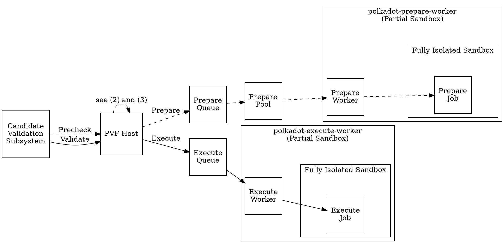

# PVF Host and Workers

The PVF host is responsible for handling requests to prepare and execute PVF
code blobs, which it sends to PVF **workers** running in their own child
processes. These workers are spawned from the `polkadot-prepare-worker` and
`polkadot-execute-worker` binaries.

While the workers are generally long-living, they also spawn one-off secure
**job processes** that perform the jobs. See "Job Processes" section below.

## High-Level Flow

Some notes about the graph:

1. Once a job has finished, the response will flow back up the way it came.
2. In the case of execution, the host will send a request for preparation to the
   Prepare Queue if needed. In that case, only after the preparation succeeds
   does the Execute Queue continue with validation.
3. Multiple requests for preparing the same artifact are coalesced, so that the
   work is only done once.

## Goals

This system has two high-level goals that we will touch on here: *determinism*
and *security*.

## Determinism

One high-level goal is to make PVF operations as deterministic as possible, to
reduce the rate of disputes. Disputes can happen due to e.g. a job timing out on
one machine, but not another. While we do not have full determinism, there are
some dispute reduction mechanisms in place right now.

### Retrying execution requests

If the execution request fails during **preparation**, we will retry if it is
possible that the preparation error was transient (e.g. if the error was a panic
or time out). We will only retry preparation if another request comes in after
15 minutes, to ensure any potential transient conditions had time to be
resolved. We will retry up to 5 times.

If the actual **execution** of the artifact fails, we will retry once if it was
a possibly transient error, to allow the conditions that led to the error to
hopefully resolve. We use a more brief delay here (1 second as opposed to 15
minutes for preparation (see above)), because a successful execution must happen
in a short amount of time.

If the execution fails during the backing phase, we won't retry to reduce the chance of
supporting nondeterministic candidates. This reduces the chance of nondeterministic blocks
getting backed and honest backers getting slashed.

We currently know of the following specific cases that will lead to a retried
execution request:

1. **OOM:** We have memory limits to try to prevent attackers from exhausting
   host memory. If the memory limit is hit, we kill the job process and retry
   the job. Alternatively, the host might have been temporarily low on memory
   due to other processes running on the same machine. **NOTE:** This case will
   lead to voting against the candidate (and possibly a dispute) if the retry is
   still not successful.
2. **Syscall violations:** If the job attempts a system call that is blocked by
   the sandbox's security policy, the job process is immediately killed and we
   retry. **NOTE:** In the future, if we have a proper way to detect that the
   job died due to a security violation, it might make sense not to retry in
   this case.
3. **Artifact missing:** The prepared artifact might have been deleted due to
   operator error or some bug in the system.
4. **Job errors:** For example, the job process panicked for some indeterminate
   reason, which may or may not be independent of the candidate or PVF.
5. **Internal errors:** See "Internal Errors" section. In this case, after the
   retry we abstain from voting.

### Preparation timeouts

We use timeouts for both preparation and execution jobs to limit the amount of
time they can take. As the time for a job can vary depending on the machine and
load on the machine, this can potentially lead to disputes where some validators
successfully execute a PVF and others don't.

One dispute mitigation we have in place is a more lenient timeout for
preparation during execution than during pre-checking. The rationale is that the
PVF has already passed pre-checking, so we know it should be valid, and we allow
it to take longer than expected, as this is likely due to an issue with the
machine and not the PVF.

### CPU clock timeouts

Another timeout-related mitigation we employ is to measure the time taken by
jobs using CPU time, rather than wall clock time. This is because the CPU time
of a process is less variable under different system conditions. When the
overall system is under heavy load, the wall clock time of a job is affected
more than the CPU time.

### Internal errors

An internal, or local, error is one that we treat as independent of the PVF
and/or candidate, i.e. local to the running machine. If this happens, then we
will first retry the job and if the errors persists, then we simply do not vote.
This prevents slashes, since otherwise our vote may not agree with that of the
other validators.

In general, for errors not raising a dispute we have to be very careful. This is
only sound, if either:

1. We ruled out that error in pre-checking. If something is not checked in
   pre-checking, even if independent of the candidate and PVF, we must raise a
   dispute.
2. We are 100% confident that it is a hardware/local issue: Like corrupted file,
   etc.

Reasoning: Otherwise it would be possible to register a PVF where candidates can
not be checked, but we don't get a dispute - so nobody gets punished. Second, we
end up with a finality stall that is not going to resolve!

Note that any error from the job process we cannot treat as internal. The job
runs untrusted code and an attacker can therefore return arbitrary errors. If
they were to return errors that we treat as internal, they could make us abstain
from voting. Since we are unsure if such errors are legitimate, we will first
retry the candidate, and if the issue persists we are forced to vote invalid.

## Security

With [on-demand parachains](https://github.com/orgs/paritytech/projects/67), it
is much easier to submit PVFs to the chain for preparation and execution. This
makes it easier for erroneous disputes and slashing to occur, whether
intentional (as a result of a malicious attacker) or not (a bug or operator
error occurred).

Therefore, another goal of ours is to harden our security around PVFs, in order
to protect the economic interests of validators and increase overall confidence
in the system.

### Possible attacks / threat model

Webassembly is already sandboxed, but there have already been reported multiple
CVEs enabling remote code execution. See e.g. these two advisories from
[Mar 2023](https://github.com/bytecodealliance/wasmtime/security/advisories/GHSA-ff4p-7xrq-q5r8)
and [Jul 2022](https://github.com/bytecodealliance/wasmtime/security/advisories/GHSA-7f6x-jwh5-m9r4).

So what are we actually worried about? Things that come to mind:

1. **Consensus faults** - If an attacker can get some source of randomness they
   could vote against with 50% chance and cause unresolvable disputes.
2. **Targeted slashes** - An attacker can target certain validators (e.g. some
   validators running on vulnerable hardware) and make them vote invalid and get
   them slashed.
3. **Mass slashes** - With some source of randomness they can do an untargeted
   attack. I.e. a baddie can do significant economic damage by voting against
   with 1/3 chance, without even stealing keys or completely replacing the
   binary.
4. **Stealing keys** - That would be pretty bad. Should not be possible with
   sandboxing. We should at least not allow filesystem-access or network access.
5. **Taking control over the validator.** E.g. replacing the `polkadot` binary
   with a `polkadot-evil` binary. Should again not be possible with the above
   sandboxing in place.
6. **Intercepting and manipulating packages** - Effect very similar to the
   above, hard to do without also being able to do 4 or 5.

We do not protect against (1), (2), and (3), because there are too many sources
of randomness for an attacker to exploit.

We provide very good protection against (4), (5), and (6).

### Job Processes

As mentioned above, our architecture includes long-living **worker processes**
and one-off **job processes**. This separation is important so that the handling
of untrusted code can be limited to the job processes. A hijacked job process
can therefore not interfere with other jobs running in separate processes.

Furthermore, if an unexpected execution error occurred in the execution worker
and not the job itself, we generally can be confident that it has nothing to do
with the candidate, so we can abstain from voting. On the other hand, a hijacked
job is able to send back erroneous responses for candidates, so we know that we
should not abstain from voting on such errors from jobs. Otherwise, an attacker
could trigger a finality stall. (See "Internal Errors" section above.)

### Restricting file-system access

A basic security mechanism is to make sure that any process directly interfacing
with untrusted code does not have unnecessary access to the file-system. This
provides some protection against attackers accessing sensitive data or modifying
data on the host machine.

*Currently this is only supported on Linux.*

### Restricting networking

We also disable networking on PVF threads by disabling certain syscalls, such as
the creation of sockets. This prevents attackers from either downloading
payloads or communicating sensitive data from the validator's machine to the
outside world.

*Currently this is only supported on Linux.*

### Clearing env vars

We clear environment variables before handling untrusted code, because why give
attackers potentially sensitive data unnecessarily? And even if everything else
is locked down, env vars can potentially provide a source of randomness (see
point 1, "Consensus faults" above).
