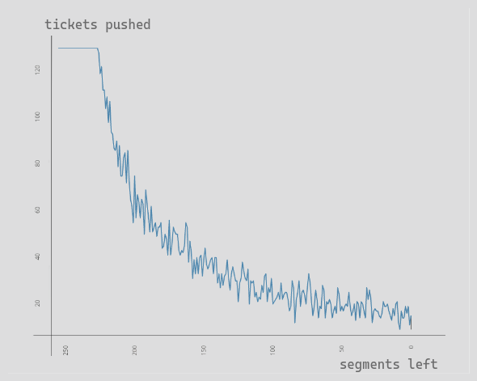

# Segments Incremental Sorting Strategy Empirical Results

Parameters:
- 128 segments
- segment max length 128
- 32767 random tickets ids
- epoch length 3600 (== max tickets to keep)

The table shows the comparison between the segments left in the unsorted segments buffer
and the number of new tickets which are added from the last segment to the sorted tickets
buffer (i.e. how many tickets we retain from the last processed segment)

| Segments Left | Tickets Pushed |
|-----|-----|
| 255 | 128 |
| 254 | 128 |
| 253 | 128 |
| 252 | 128 |
| 251 | 128 |
| 250 | 128 |
| 249 | 128 |
| 248 | 128 |
| 247 | 128 |
| 246 | 128 |
| 245 | 128 |
| 244 | 128 |
| 243 | 128 |
| 242 | 128 |
| 241 | 128 |
| 240 | 128 |
| 239 | 128 |
| 238 | 128 |
| 237 | 128 |
| 236 | 128 |
| 235 | 128 |
| 234 | 128 |
| 233 | 128 |
| 232 | 128 |
| 231 | 128 |
| 230 | 128 |
| 229 | 128 |
| 228 | 128 |
| 227 | 128 |
| 226 | 126 |
| 225 | 117 |
| 224 | 120 |
| 223 | 110 |
| 222 | 110 |
| 221 | 102 |
| 220 | 107 |
| 219 | 96 |
| 218 | 105 |
| 217 | 92 |
| 216 | 91 |
| 215 | 85 |
| 214 | 84 |
| 213 | 88 |
| 212 | 77 |
| 211 | 86 |
| 210 | 73 |
| 209 | 73 |
| 208 | 81 |
| 207 | 83 |
| 206 | 70 |
| 205 | 84 |
| 204 | 71 |
| 203 | 63 |
| 202 | 60 |
| 201 | 53 |
| 200 | 73 |
| 199 | 55 |
| 198 | 65 |
| 197 | 62 |
| 196 | 55 |
| 195 | 63 |
| 194 | 61 |
| 193 | 48 |
| 192 | 67 |
| 191 | 61 |
| 190 | 55 |
| 189 | 49 |
| 188 | 60 |
| 187 | 49 |
| 186 | 51 |
| 185 | 53 |
| 184 | 47 |
| 183 | 51 |
| 182 | 51 |
| 181 | 53 |
| 180 | 42 |
| 179 | 43 |
| 178 | 48 |
| 177 | 46 |
| 176 | 39 |
| 175 | 54 |
| 174 | 39 |
| 173 | 44 |
| 172 | 51 |
| 171 | 49 |
| 170 | 48 |
| 169 | 48 |
| 168 | 41 |
| 167 | 39 |
| 166 | 41 |
| 165 | 40 |
| 164 | 43 |
| 163 | 53 |
| 162 | 51 |
| 161 | 36 |
| 160 | 45 |
| 159 | 40 |
| 158 | 29 |
| 157 | 37 |
| 156 | 31 |
| 155 | 38 |
| 154 | 31 |
| 153 | 38 |
| 152 | 39 |
| 151 | 30 |
| 150 | 37 |
| 149 | 42 |
| 148 | 35 |
| 147 | 33 |
| 146 | 35 |
| 145 | 37 |
| 144 | 38 |
| 143 | 31 |
| 142 | 38 |
| 141 | 38 |
| 140 | 27 |
| 139 | 31 |
| 138 | 25 |
| 137 | 31 |
| 136 | 26 |
| 135 | 30 |
| 134 | 31 |
| 133 | 37 |
| 132 | 29 |
| 131 | 24 |
| 130 | 31 |
| 129 | 34 |
| 128 | 31 |
| 127 | 28 |
| 126 | 28 |
| 125 | 19 |
| 124 | 27 |
| 123 | 29 |
| 122 | 36 |
| 121 | 32 |
| 120 | 29 |
| 119 | 28 |
| 118 | 33 |
| 117 | 18 |
| 116 | 28 |
| 115 | 27 |
| 114 | 28 |
| 113 | 21 |
| 112 | 23 |
| 111 | 19 |
| 110 | 21 |
| 109 | 20 |
| 108 | 26 |
| 107 | 23 |
| 106 | 30 |
| 105 | 31 |
| 104 | 19 |
| 103 | 25 |
| 102 | 23 |
| 101 | 29 |
| 100 | 18 |
| 99 | 19 |
| 98 | 20 |
| 97 | 21 |
| 96 | 23 |
| 95 | 20 |
| 94 | 27 |
| 93 | 20 |
| 92 | 22 |
| 91 | 23 |
| 90 | 23 |
| 89 | 20 |
| 88 | 15 |
| 87 | 17 |
| 86 | 28 |
| 85 | 25 |
| 84 | 10 |
| 83 | 20 |
| 82 | 23 |
| 81 | 28 |
| 80 | 17 |
| 79 | 23 |
| 78 | 24 |
| 77 | 22 |
| 76 | 18 |
| 75 | 25 |
| 74 | 31 |
| 73 | 27 |
| 72 | 19 |
| 71 | 13 |
| 70 | 17 |
| 69 | 24 |
| 68 | 20 |
| 67 | 12 |
| 66 | 17 |
| 65 | 16 |
| 64 | 26 |
| 63 | 24 |
| 62 | 12 |
| 61 | 19 |
| 60 | 18 |
| 59 | 20 |
| 58 | 18 |
| 57 | 12 |
| 56 | 15 |
| 55 | 17 |
| 54 | 14 |
| 53 | 25 |
| 52 | 22 |
| 51 | 15 |
| 50 | 17 |
| 49 | 15 |
| 48 | 17 |
| 47 | 18 |
| 46 | 17 |
| 45 | 23 |
| 44 | 17 |
| 43 | 13 |
| 42 | 15 |
| 41 | 18 |
| 40 | 11 |
| 39 | 19 |
| 38 | 18 |
| 37 | 12 |
| 36 | 19 |
| 35 | 18 |
| 34 | 15 |
| 33 | 12 |
| 32 | 25 |
| 31 | 20 |
| 30 | 24 |
| 29 | 20 |
| 28 | 10 |
| 27 | 15 |
| 26 | 16 |
| 25 | 15 |
| 24 | 15 |
| 23 | 13 |
| 22 | 12 |
| 21 | 14 |
| 20 | 19 |
| 19 | 17 |
| 18 | 17 |
| 17 | 18 |
| 16 | 15 |
| 15 | 13 |
| 14 | 11 |
| 13 | 16 |
| 12 | 13 |
| 11 | 18 |
| 10 | 19 |
| 9 | 10 |
| 8 | 7 |
| 7 | 15 |
| 6 | 12 |
| 5 | 12 |
| 4 | 17 |
| 3 | 14 |
| 2 | 17 |
| 1 | 9 |
| 0 | 13

# Graph of the same data

