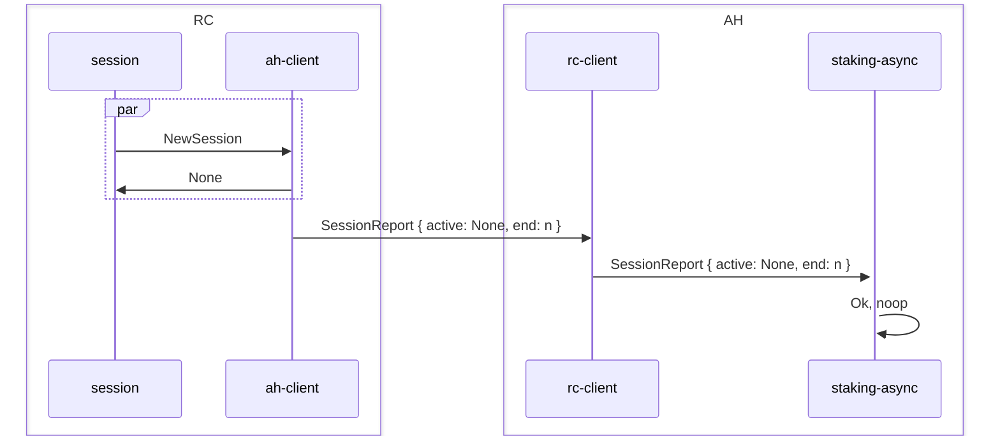
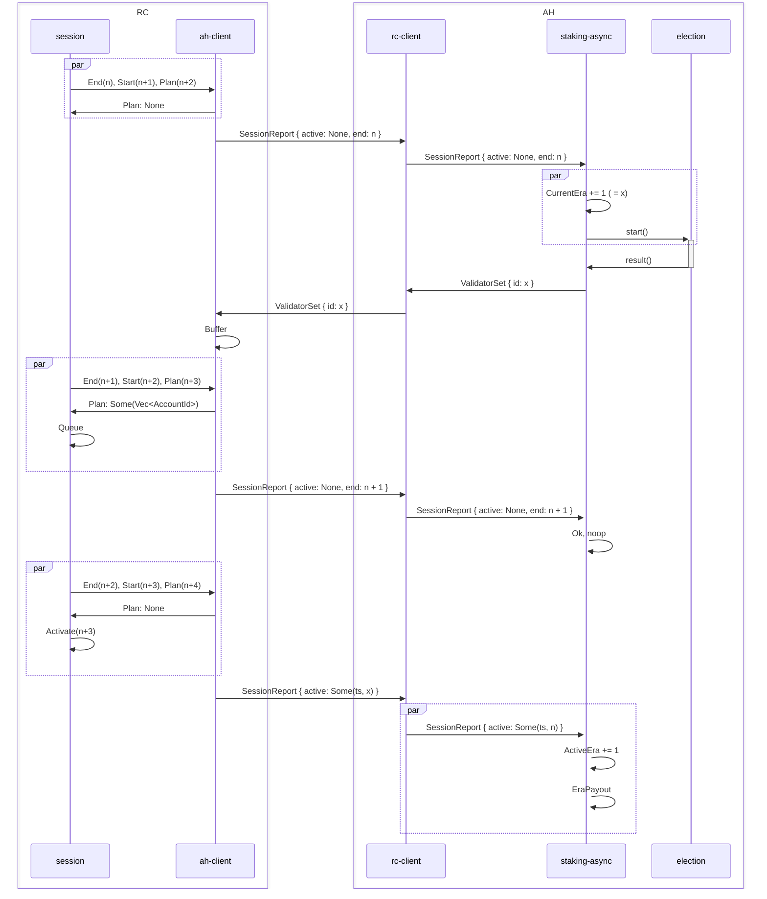
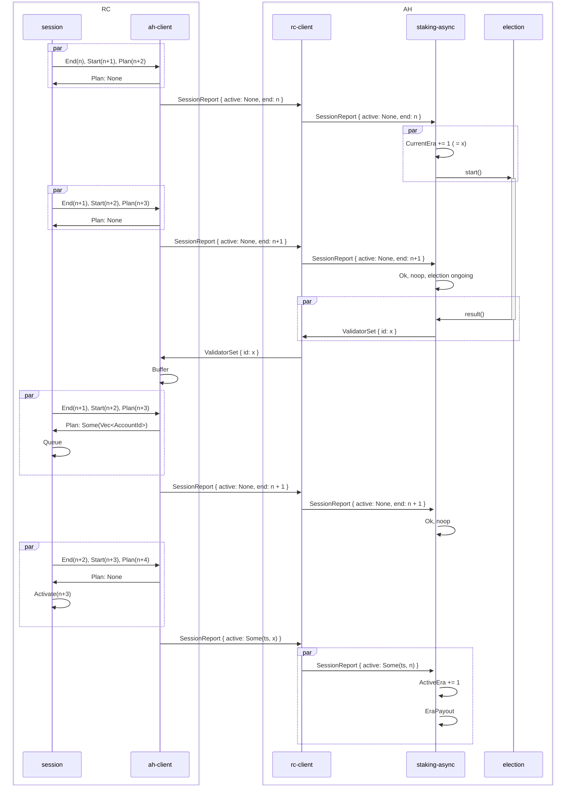

# Cross Chain Interactions

<!-- toc -->

This chapter describes how AH and RC communicate with one another. Before doing so, let's look at a subset of
`pallet-session`, living in RC, which is relevant to us.

## Session Pallet

Three interfaces in `pallet-session` are of interest to us:

{{#include ../../../session/src/lib.rs:session_types}}

*   `SessionManager` was historically implemented by `pallet-staking`.
*   `SessionInterface` is a tuple of all consensus-related pallets that wish to be notified of new authorities and their
    session keys, such as BABE, Aura, GrandPa, Beefy, and so on.
*   `ShouldEndSession` is usually implemented either by `pallet-babe`, if used in the runtime, or by a type that
    dictates a fixed-length session duration, such as:

```rust,noplayground,no_run
{{#include ../../../session/src/lib.rs:periodic_sessions}}
```

> The naming for all of the above is admittedly not super informative and is a technical debt.

Further, let's look at the details of how the `SessionManager` is expected to work:

It exposes 3 distinct functions:

1.  `new_session`
2.  `end_session`
3.  `start_session`

This is all a bit confusing, so we take the liberty of relying on how `pallet_session` calls into these functions to
explain them. All of this can be found in `fn rotate_session`.

In short, the above functions are always called in the following order:

```rust,noplayground,no_run
end_session(x-1);
start_session(x);
let maybe_new_validators: Option<_> = new_session(x+1)
```

As in, `pallet-session` is reporting to its _manager_ that:

1. Session `x-1` has ended
2. Session `1` has started
3. please plan session `x+1`

> A much better name for `new_session` would be `plan_session`.

Then, at any point in time, if `new_session` returns `Some(_)`, the session pallet will **queue** the new validators,
and **activate** them in the next session. **Only when activated**, the validator keys associated with the new
validators will be used for consensus, and reported to the `SessionInterface` recipients.

## Session Reports (RC -> AH)

With this in mind, let's first look at how the session formation is communicated from RC to AH.

* We simplify the process by making the assumption on the above 3 calls, and **only communicate the index of the ending
session to AH**. The other two can be derived.
* With each session report, we send the list of validators, and how many "points" they have accumulated during that
  session. This can be used by AH to reward the validators.
* Finally, if we have previously received a validator set from AH, and we have now activated it _NOW_ (as a part of
  ending of session `x`, which implies start of session `x+1`), we will report back two critical pieces of information
  about it:
  * What was the identifier of that validator set
  * What is the timestamp at the time of activation. This is also used by AH to determine the duration for which a set
    of validators were active, from which the era duration is derived, from which the inflation is computed.

```rust,noplayground,no_run
{{#include ../../rc-client/src/lib.rs:session_report}}
```

You may see how `pallet-staking-async-ah-client` implements `SessionManager` to learn more.

## Validator Set Report (AH -> RC)

Then, let's look at the same story from the perspective of AH. AH received the said session reports, and from it, it
will try and estimate by when RC wishes to have a new validator set received. This is covered in the [Session and Era
Rotation](./sessions-era.md) chapter.

Regardless, at some point, AH will decide that it is time to start a new election (see [Election and
Exposures](./election.md)). Once this is determined, it will do the following:

1. It will bump its counter of `CurrentEra` by one. This is in fact the *Planning Era*.
2. It will conduct the election process, which might take an arbitrary amount of time.
3. Once done, it will immediately send this new set to RC. It uses the `CurrentEra` (planning era) as the `id` for this
   new validator set.
4. Then, it will await a subsequent `SessionReport` which contains `activation_timestamp` of `Some(_)`, with the id that
   it has previously provided. Once this is received, it will bump its `ActiveEra`, with the corresponding timestamp.

```rust,noplayground,no_run
{{#include ../../rc-client/src/lib.rs:val_report}}
```

The `prune_up_to` field is used to signal the RC that a given session index is old enough, and its historical data can
now be pruned. In other words, we are no longer interested in slashing a validator for this session. This is further
explained in `TODO: link to the right chapter once written`.

You may see how `pallet-staking-async-rc-client` implements `RcClientInterface`, in which it a validator set is sent.

## Offences

Nothing is special about offence reports. They are reported from RC to AH as they come in. See [Slashing](./slashing.md)


```rust,noplayground,no_run
{{#include ../../rc-client/src/lib.rs:offence}}
```

Note that the actual XCM message is a `Vec<OffenceReport>`.

## Visual Summary

To summarize this, let's look at 3 scenarios:

### Noop Session Report

A session report from RC to AH, in reaction to whch AH does not start an election.




### Session Report Starting a Short Election

Then, let's look at when a session report makes AH realize it should start an election, and how the results are sent
back. In this examople, we assume the election completes within one session.



### Session Report Starting a Long Election

Finally, let's look at the same example as before, but when the election takes long enough for a session to come in
between.




## Further Reading

* The crate documentation of `pallet-staking-async-ah-client` and `pallet-staking-async-rc-client` contains a lot of
  further details about the communication.
