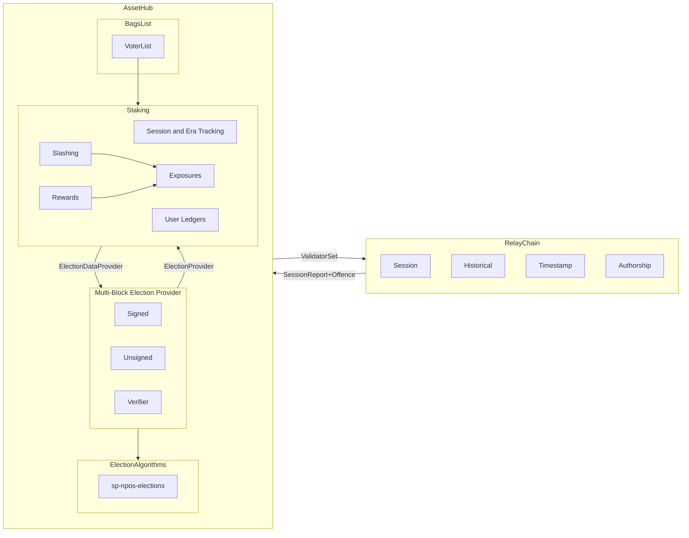

# Overview

This chapter paints an overview of the staking system, and its sub-components.

> Note that by any reference to "staking", we mean the `pallet-staking-async`.

The entire system documented here is heavily biased towards Polkadot's needs, and is no longer a _generic_ staking system by any means.

The majority of this system lives on a (system) parachain, which we refer to as **AssetHub** (**AH** for short), and a small part of it on the Polkadot relay-chain (**RC** for short).

The end goal for this system is for the staking system on AssetHub to elect a secure validator set for the relay-chain, and communicate it to the relay-chain. in a timely fashion.

The workings of the staking system can broadly be divided into the following components:



The following sections describe each of these components in short, with a link to a dedicated chapter.

## AssetHub Components

Let's first describe the components that live on the AssetHub parachain.

### User Ledgers/Interactions

This is the part of the system that allows users to `bond` tokens, `unbond` them, and declare their intentions to `nominate`, `validate`, and so on.

This system is fairly simple, not changed by much since the launch of the first iteration of Polkadot, and is described in detail in the [User Interface](./user-interactions.md) chapter.

### Sessions and Eras

An era is the basic "_unit of time_" for the staking system. It is denominated in a number of smaller units called "sessions". **The goal system is to elect a new validator set every era**.

The role of this subsystem is to keep track of the session/era progress, keep track of all of the associated data, and trigger the election in due time.

More in [Sessions and Eras](./sessions-era.md).

### Election and Exposures

Following the above section, when the right time comes, the staking system will ask its `type ElectionProvider` to perform a new validator set to it. The process eventually completes, and is described in detail in the [Election and Exposures](./election.md) chapter.

> To perform the election, both: `sp-npos-elections` and `VoterList` are used under the hood, which are not covered in detail here

Worth noting is that the final outcome of the election process is what we call `Exposure`: a `struct` identifying:

* A validator that is now elected
* A list of nominators who are backing the said validator

```rust,noplayground
{{#include ../../../../primitives/staking/src/lib.rs:exposure}}
```

By being in an exposure, a nominator/validator is entitled to both staking rewards, and slashing penalties, ergo they are said to be _exposed_.


### Slashing and Rewards

As said, these two systems work mainly on the basis of looking at the set of exposed validators and nominators. Their detailed description is in the [Slashing](./slashing.md) and [Rewards](./rewards.md).


## Relay Chain Components

* Session, and Historical information thereof.
* Authorship, the ability to know which validators produced blocks, among other actions worthy of being rewarded

## Cross Chain Interactions

TODO

## Complementary Documentation

While this book gives a holistic overview of the system, we make our best effort to have each of the involved pallets also have high quality API docs. Find the latest released versions of this in docs.rs, or in the hosted version from `polkadot-sdk` master below:

- [`pallet-staking-async`](https://paritytech.github.io/polkadot-sdk/master/pallet_staking_async/index.html)
- [`pallet-election-provider-multi-block`](https://paritytech.github.io/polkadot-sdk/master/pallet_election_provider_multi_block/index.html)
- [`pallet-bags-list`](https://paritytech.github.io/polkadot-sdk/master/pallet_bags_list/index.html)
- [`sp-npos-elections`](https://paritytech.github.io/polkadot-sdk/master/sp_npos_elections/index.html)
