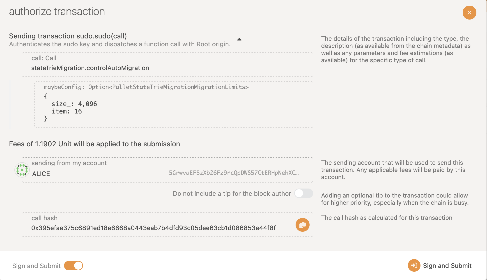
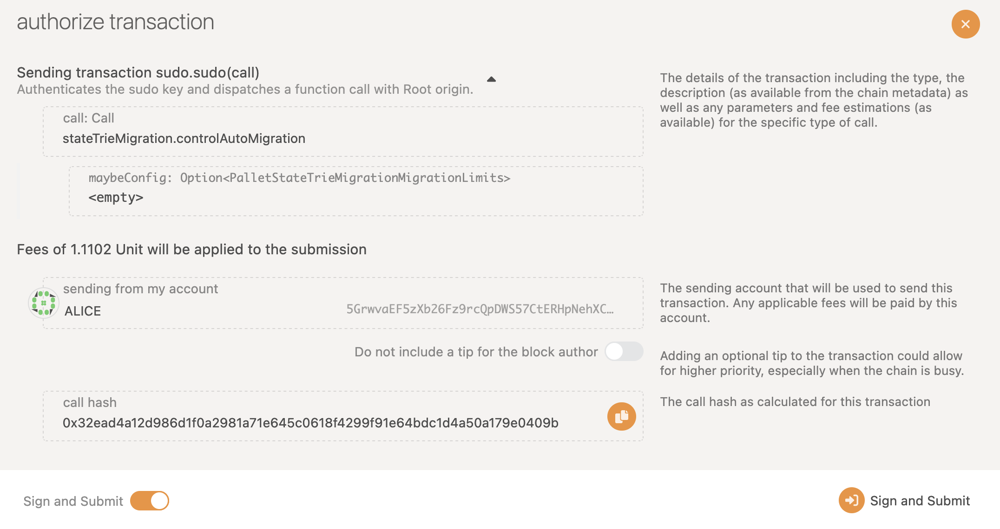
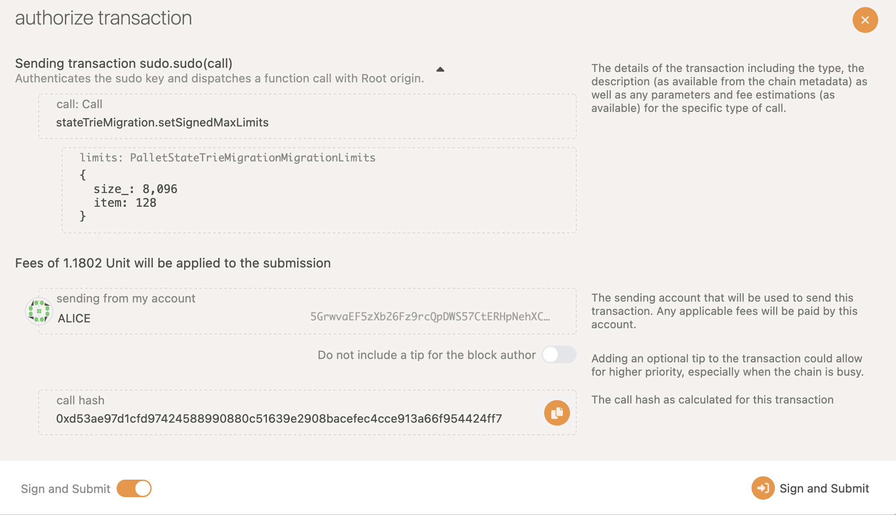
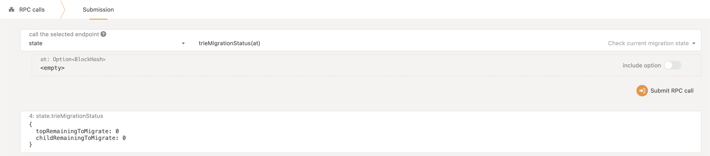

<!-- markdownlint-disable-file MD013 -->
# Substrate State Trie Migration Guide

## Context

The [trie](https://github.com/paritytech/trie) is an abstraction that sits between the Runtime (and its [Overlays](https://paritytech.github.io/substrate/master/sp_state_machine/struct.OverlayedChanges.html)) and the actual database, providing an important abstraction to the blockchain, namely storage proofs and state roots.

The trie format has changed since [this pull request](https://github.com/paritytech/substrate/pull/9732)(#9732) in Substrate. The main new difference is that nodes that contain values larger than 256 bits will **not** store the value itself, but rather store the **hash of that value**. The value itself is consequently stored in the node that lives in the path traversed by this new hash.

The main benefit of this optimization is better PoV (proof of validity) size for parachains, since large values are moved out of the common trie paths.

The new trie has been included in the Polkadot client since release [v0.9.16](https://github.com/paritytech/polkadot/releases/tag/v0.9.16). Although, the new trie format is not yet enabled. This is only done once `state_version` in `RuntimeVersion` is set to `1`. Once set to `1`, the trie works in a hybrid format, meaning that no migration is needed. Instead, migration is done lazily on the fly. Any storage key that's written to will be migrated if needed. This means that a part of all chain's state will be migrated to the new format pretty soon after setting `state_version` to `1`.

Nonetheless, it might take a long time for the entire chain's state to be migrated to the new format. The sooner this happens, the better, since the lazy migration is a small overhead. Moreover, this hybrid/lazy state mode does not support warp-sync and state import/export.

To do this faster, we have developed this `pallet-state-trie-migration`. This pallet is a configurable background task that starts reading and writing all keys in the storage based on some given schedule until they are all read, ergo migrated. This pallet can be deployed to a runtime to make sure all keys are read/written once, to ensure that all trie nodes are migrated to the new format.

All Substrate-based chains are advised to switch their `state_version` to `1`, and use this pallet to migrate to the new trie format as soon as they can. Switching the `state_version` will enable the hybrid, lazy migration mode, and this pallet will speed up the migration process.

## pallet-state-trie-migration: How to Deploy

See docs.rs: [pallet_state_trie_migration](https://docs.rs/pallet-state-trie-migration/latest/pallet_state_trie_migration/)

First, please read the documentation of this pallet. Here, we recap the steps needed to use the migration pallet. To give a brief recap, we suggest:

1. Parachains use the signed migration, as it allows more control.
2. Relay/solo chains use the automatic migration, as it is easier.

Nonetheless, the safest possible option is to always use the signed migration.

### 1. Adding the pallet to the runtime

The following documented snippet shows the parameters that need to be decided upon in your chain in order to configure this pallet. Note that the values below are simply an example, and the exact value for each chain would vary.

```rust
use pallet_state_trie_migration::MigrationLimits;
parameter_types! {
    // The deposit configuration for the signed migration. 
    // Especially if you want to allow any signed account to do the migration (see `SignedFilter`, these deposits should be high)
    pub const MigrationSignedDepositPerItem: Balance = 1 * CENTS;
    pub const MigrationSignedDepositBase: Balance = 20 * DOLLARS;
}

impl pallet_state_trie_migration::Config for Runtime {
    type Event = Event;
    type Currency = Balances;
    type SignedDepositPerItem = MigrationSignedDepositPerItem;
    type SignedDepositBase = MigrationSignedDepositBase;
    // An origin that can control the whole pallet: should be Root, or a part of your council. 
    type ControlOrigin = EnsureRoot<AccountId>;
    // Warning: this is not advised, as it might allow the chain to be temporarily DOS-ed. 
    // If the chain's governance/maintenance team is planning on using a specific account for the migration, 
    // put it here to make sure only that account can trigger the signed migrations.
    type SignedFilter = EnsureSigned<Self::AccountId>;
    // Replace this with weight based on your runtime. 
    type WeightInfo = ();
}
```

You also need to include the pallet in your `contruct_runtime!`, and `define_benchmarks!`. **Don't forget to update `type WeightInfo` once you have realistic weights**!

### 2.1 Running the automatic migration

To run the automatic migration, you need to use the `ControlOrigin` to set 1 storage value that determines how much resources should be used per block. Once you set this, the pallet will automatically migrate enough items `on_initialize` of all the following blocks, until all keys are migrated.

> `on_initialize` might go over the limits provided, because we can never know the real size of a key before reading it, at which point it is actually too late. Thus, it should NOT be used in a parachain.
> If you are sure you want to do the migration this way, you should set `SignedFilter` such that no account can call the manual signed migrations, just in case.

Let's look at `staging-node-cli --dev --execution Native -lruntime::state-trie-migration=debug` chain that includes this pallet. Initially, the logs don't show anything relevant.

Here is an example of a sudo transaction that kicks of the migration with a maximum of 8 items and 4kb of data per block:



> If at any point you need to stop the migration, the same transaction can be used, instead this time you have to set the value to `None`, as such:



Keep an eye out of logs like this:

```bash
...
runtime::state-trie-migration: [39] 🤖 running migrations on top of MigrationTask { top: To start, child: To start, dyn_top_items: 0, dyn_child_items: 0, dyn_size: 0, size: 0, top_items: 0, child_items: 0 } until MigrationLimits { size: 4096, item: 16 }
runtime::state-trie-migration: [39] 🤖 finished with MigrationTask { top: Last: 1cb6f36e027abb2091cfb5110ab5087f66e8f035c8adbe7f1547b43c51e6f8a4, child: To start, dyn_top_items: 16, dyn_child_items: 0, dyn_size: 113, size: 113, top_items: 16, child_items: 0 }
runtime::state-trie-migration: [39] 🤖 migrated 16 top keys, 0 child keys, and a total of 113 bytes.
...

substrate: ✨ Imported #39 (0xf47f…7498)
runtime::state-trie-migration: [40] 🤖 running migrations on top of MigrationTask { top: Last: 1cb6f36e027abb2091cfb5110ab5087f66e8f035c8adbe7f1547b43c51e6f8a4, child: To start, dyn_top_items: 0, dyn_child_items: 0, dyn_size: 0, size: 113, top_items: 16, child_items: 0 } until MigrationLimits { size: 4096, item: 16 }
runtime::state-trie-migration: [40] 🤖 finished with MigrationTask { top: Last: 26aa394eea5630e07c48ae0c9558cef7a44704b568d21667356a5a050c11874601cfe8bf76ba27f01e000000, child: To start, dyn_top_items: 16, dyn_child_items: 0, dyn_size: 550, size: 663, top_items: 32, child_items: 0 }
runtime::state-trie-migration: [40] 🤖 migrated 16 top keys, 0 child keys, and a total of 550 bytes.
...
substrate: ✨ Imported #40 (0x1c44…b5c3)
runtime::state-trie-migration: [41] 🤖 running migrations on top of MigrationTask { top: Last: 26aa394eea5630e07c48ae0c9558cef7a44704b568d21667356a5a050c11874601cfe8bf76ba27f01e000000, child: To start, dyn_top_items: 0, dyn_child_items: 0, dyn_size: 0, size: 663, top_items: 32, child_items: 0 } until MigrationLimits { size: 4096, item: 16 }
runtime::state-trie-migration: [41] 🤖 finished with MigrationTask { top: Last: 26aa394eea5630e07c48ae0c9558cef7a44704b568d21667356a5a050c11874666ccada06515787c10000000, child: To start, dyn_top_items: 16, dyn_child_items: 0, dyn_size: 512, size: 1175, top_items: 48, child_items: 0 }
runtime::state-trie-migration: [41] 🤖 migrated 16 top keys, 0 child keys, and a total of 512 bytes.
```

And once the whole migration is done, the pallet will no longer do anything henceforth:

```bash
runtime::state-trie-migration: [53] 🤖 running migrations on top of MigrationTask { top: Last: ede8e4fdc3c8b556f0ce2f77fc2575e34e7b9012096b41c4eb3aaf947f6ea429, child: To start, dyn_top_items: 0, dyn_child_items: 0, dyn_size: 0, size: 1202966, top_items: 201, child_items: 0 } until MigrationLimits { size: 4096, item: 16 }
runtime::state-trie-migration: [53] 🤖 finished with MigrationTask { top: Complete, child: To start, dyn_top_items: 9, dyn_child_items: 0, dyn_size: 29, size: 1202995, top_items: 210, child_items: 0 }
runtime::state-trie-migration: [53] 🤖 migrated 9 top keys, 0 child keys, and a total of 29 bytes.
```

At this point, you should remove the pallet from the runtime, and you are done 🎉.

> The `MigrationTask` struct that is being printed in `debug` mode contains a lot of interesting information.
>
See [the Rustdocs](https://github.com/paritytech/polkadot-sdk/blob/master/substrate/frame/state-trie-migration/src/lib.rs#L142)
> for more info.

### 2.2 Running the signed migration

Next, let's look at how we can do the migration using the signed submissions. For this, we have developed a basic bot in the [`polkadot-scripts`](https://github.com/paritytech/polkadot-scripts/blob/master/src/services/state_trie_migration.ts) repo.

First, the signed migrations have a configuration very similar to that of automatic migration, to dictate the maximum amount of data that can be migrated in each signed transaction. This can be set using [`set_signed_max_limits`](https://github.com/paritytech/substrate/blob/77c15d2546276a865b6e8f1c5d4b1d0ec1961e72/frame/state-trie-migration/src/lib.rs#L717), which sets the storage item `SignedMigrationMaxLimits`. If not set, signed submissions are not allowed at all.

This bot is just an example of how the signed migration can be done, and is a mere ~100 LoC. You are welcome to alter, fork, or re-write this bot based on your chain's need.

> For example, this bot will always wait for the previous transaction to reach *full finalization*, and then submit again. You might want to change this to speed things up.

The bot takes 3 arguments:

1. `count`: the count of transactions to send: this is useful if you want to manually control the bot, for a short amount of time. For example, one execution will only send 10 transactions and terminate. If not set, the bot will work indefinitely until finished.
2. `item-limit`: the limit on the number of items that the bot tries to migrate per transaction.
3. `size-limit`: the limit on the size of the items that the bot tries to migrate per transaction.

Also, the [`continue_migrate`](https://github.com/paritytech/substrate/blob/77c15d2546276a865b6e8f1c5d4b1d0ec1961e72/frame/state-trie-migration/src/lib.rs#L536) transaction, which the bot submits, expects an upper bound on the size of data migrated, aside from `item-limit`. For this, the bot will always use `item-limit * 2`.

These parameters should be parsed as follows:

> With each transaction, the bot is making a bet that migrating the next `item-limit` will not consume more `2 * size-limit` bytes of data.

It would be futile for the bot to actually submit transactions to find the answer to this bet, since it costs money. Therefore, the bot uses the unsafe `dryRun` RPC endpoint to make sure the above assumption is met.

If the `dryRun` fails, the bot will re-try with **halving the `item-limit`**. If `item-limit` reaches `0`, it means that the next key that needs to be migrated is larger than `2 * size-limit` and the bot needs to be re-executed with a larger `size-limit`. This could happen if for example the next key that needs to be migrated is e.g. the `:code:`.

> Also, note that your provided `size-limit` and `item-limit` should be less than the aforementioned `SignedMigrationMaxLimits`.

With all of this, let's finally see an example. Lets assume your `node` is configured to allow any signed account to submit the signed migration like [here](https://github.com/polkadot-fellows/runtimes/pull/604) for example.

First, we submit the sudo call to set `SignedMigrationMaxLimits`:



Then, we run the same `--dev` node as before, with `-lruntime::state-trie-migration=debug`.

Then, in `polkadot-scripts` we run `yarn run start state-trie-migration -w ws://localhost:7777 --item-limit 16 --size-limit 4096`. The size and item limit that we pass here should be less than the values set for `SignedMigrationMaxLimits`.

On the node, you should see similar logs as before, and in the bot something like:

```bash
🎬 current task is {"progressTop":{"lastKey":"0x26aa394eea5630e07c48ae0c9558cef7a44704b568d21667356a5a050c118746be93d8a4ce7799c00b000000"},"progressChild":{"toStart":null},"size":990,"topItems":48,"childItems":0}
🌵 dry-run of transaction: success = true {"ok":[]}
📀 Transaction continue_migrate(..) included at blockHash 0xc16efc77ba368ec5b15e2c4a379b4705d4a23c16f8f7b8476044735d7bac7e3b [success = true]
💯 Transaction continue_migrate(..) Finalized at blockHash 0xc16efc77ba368ec5b15e2c4a379b4705d4a23c16f8f7b8476044735d7bac7e3b
    🎤 {"index":"0x2b00","data":[16,0,"Signed"]}
💸 spent 0 on submission

🎬 current task is {"progressTop":{"lastKey":"0x26aa394eea5630e07c48ae0c9558cef7b99d880ec681799c0cf30e8886371da9b321d16960ce1d9190b61e2421cc60131e07379407fecc4b89eb7dbd287c2c781cfb1907a96947a3eb18e4f8e7198625"},"progressChild":{"toStart":null},"size":1875,"topItems":64,"childItems":0}
🌵 dry-run of transaction: success = true {"ok":[]}
📀 Transaction continue_migrate(..) included at blockHash 0x37fe690d2a39c20e00a6e82d830694cba476185f57745b46c9d948cdb8bbba73 [success = true]
💯 Transaction continue_migrate(..) Finalized at blockHash 0x37fe690d2a39c20e00a6e82d830694cba476185f57745b46c9d948cdb8bbba73
    🎤 {"index":"0x2b00","data":[16,0,"Signed"]}
💸 spent 0 on submission

🎬 current task is {"progressTop":{"lastKey":"0x2f85f1e1378cb2d7b83adbaf0b5869c298ef7dc060436e4ed803af07632b89b6b4def25cfda6ef3a00000000"},"progressChild":{"toStart":null},"size":2554,"topItems":80,"childItems":0}
🌵 dry-run of transaction: success = false {"err":{"module":{"index":43,"error":3}}}
🖖 halving the number of items to migrate from 16 to 8
🌵 dry-run of transaction: success = false {"err":{"module":{"index":43,"error":3}}}
🖖 halving the number of items to migrate from 16 to 4
🌵 dry-run of transaction: success = false {"err":{"module":{"index":43,"error":3}}}
🖖 halving the number of items to migrate from 16 to 2
🌵 dry-run of transaction: success = true {"ok":[]}
📀 Transaction continue_migrate(..) included at blockHash 0x961f776c5033ec9dbbc2860e30c204630e151cf27a1528dc848f11d6ca556df9 [success = true]
💯 Transaction continue_migrate(..) Finalized at blockHash 0x961f776c5033ec9dbbc2860e30c204630e151cf27a1528dc848f11d6ca556df9
    🎤 {"index":"0x2b00","data":[2,0,"Signed"]}
💸 spent 0 on submission
```

> Note that the transaction should refund the entire fee, if successful. The bot will double check this and prints the difference between its balance before and after the submission.

As you see, sometimes the bot decided to halve the number of items that get migrated, in order to meet the size limit. Unfortunately, if you run this script against a `--dev` node, you will eventually fail with:

```bash
🎬 current task is {"progressTop":{"lastKey":"0x3a2d6c9353500637d8f8e3e0fa0bb1c5ba7fb8745735dc3be2a2c61a72c39e78"},"progressChild":{"toStart":null},"size":2565,"topItems":83,"childItems":0}
🌵 dry-run of transaction: success = false {"err":{"module":{"index":43,"error":3}}}
🖖 halving the number of items to migrate from 16 to 8
🌵 dry-run of transaction: success = false {"err":{"module":{"index":43,"error":3}}}
🖖 halving the number of items to migrate from 16 to 4
🌵 dry-run of transaction: success = false {"err":{"module":{"index":43,"error":3}}}
🖖 halving the number of items to migrate from 16 to 2
🌵 dry-run of transaction: success = false {"err":{"module":{"index":43,"error":3}}}
🖖 halving the number of items to migrate from 16 to 1
🌵 dry-run of transaction: success = false {"err":{"module":{"index":43,"error":3}}}
🖖 halving the number of items to migrate from 16 to 0.5

Can't even migrate one storage key. Aborting
```

This is because our bot is configured to allow at most 4KB of data, while the next storage item is more than that. So, even converting a single storage is too much.

To figure out the actual size of the next storage item, we can look into the node logs. This is because the `dryRun` RPC tried to execute the migration of this next key, and in there we can see some detail about how many bytes it was:

```bash
🤖 running migrations on top of MigrationTask { top: Last: 3a2d6c9353500637d8f8e3e0fa0bb1c5ba7fb8745735dc3be2a2c61a72c39e78, child: To start, dyn_top_items: 0, dyn_child_items: 0, dyn_size: 0, size: 2565, top_items: 83, child_items: 0 } until MigrationLimits { size: 4096, item: 1 }
🤖 finished with MigrationTask { top: Last: 3a636f6465, child: To start, dyn_top_items: 1, dyn_child_items: 0, dyn_size: 1189420, size: 1191985, top_items: 84, child_items: 0 }
```

In fact, `3a636f6465` is the key for `:code:`, and based on the `dyn_size`, we see that it was `1189420` bytes, which is a reasonable size.

To go past this key, we need to first alter `SignedMigrationMaxLimits` to allow for this amount of data to be migrated:


Next, we re-run the bot with an item limit larger than this, and we command it to execute only one round:

```bash
 yarn run start state-trie-migration -w ws://localhost:7777 --item-limit 16 --size-limit 1189500 --count 1
```

And we should be able to go past the previous key now.

> The main lesson here is that `SignedMigrationMaxLimits` should be such that `:code:`, or whatever is the largest storage item, can be migrated as well.

To be cautious, we continue running with the previous configs, namely:

```bash
yarn run start state-trie-migration -w ws://localhost:7777 --item-limit 16 --size-limit 4096
```

And the migration should end without any further issues 🎉. The bot will automatically quit once it detects the end of the migration.

Note that you can alternatively use these transactions to re-configure the signed migration to skip certain keys, but we don't cover that here.

At any point in the migration, you can use this RPC endpoint to query how many further keys need to be upgraded.


